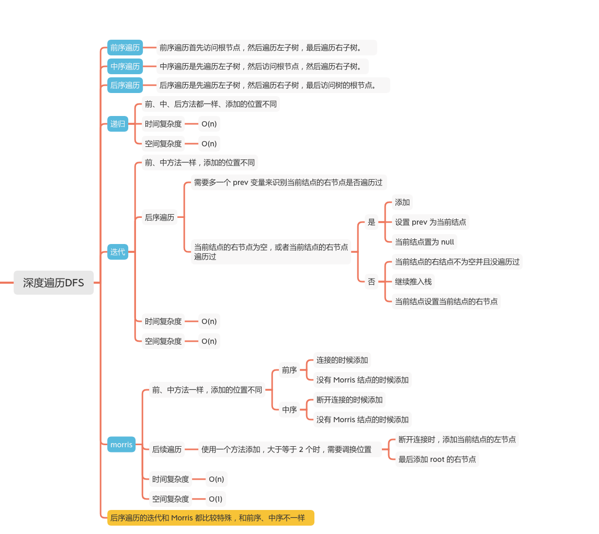
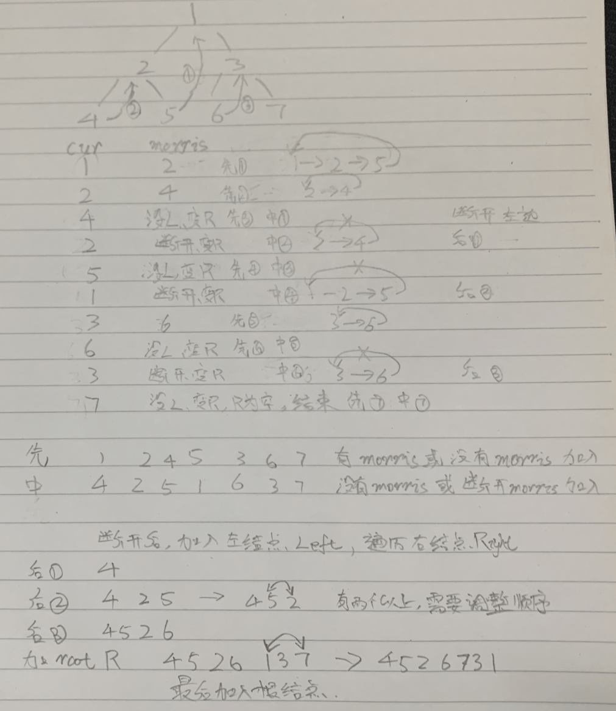

二叉树的深度遍历
=============
### LC 题目
#### [144. 二叉树的前序遍历](https://leetcode-cn.com/problems/binary-tree-preorder-traversal/)

#### [94. 二叉树的中序遍历](https://leetcode-cn.com/problems/binary-tree-inorder-traversal/)

#### [145. 二叉树的后序遍历](https://leetcode-cn.com/problems/binary-tree-postorder-traversal/)


### Morris手画说明



### 递归

```java
    /**
     * 前序遍历
     */
    public static final int PreorderTraversal = 1;
    /**
     * 中序遍历
     */
    public static final int InorderTraversal = 2;
    /**
     * 后序遍历
     */
    public static final int PostorderTraversal = 3;

    private List<Integer> list = new ArrayList<>();
    /**
     * 遍历类型
     */
    private int type = InorderTraversal;

    /**
     * 递归的方法都一样，只是添加的位置不同
     *
     * @param treeNode
     */
    private void helper(TreeNode treeNode) {
        if (treeNode == null) {
            return;
        }
        if (type == PreorderTraversal) {
            // 先序遍历，先添加
            list.add(treeNode.val);
        }
        helper(treeNode.left);
        if (type == InorderTraversal) {
            // 中序遍历，遍历完左结点添加
            list.add(treeNode.val);
        }
        helper(treeNode.right);
        if (type == PostorderTraversal) {
            // 后序遍历，遍历完左右结点添加
            list.add(treeNode.val);
        }
    }
```

### 迭代
```java
    /**
     * 前序遍历
     */
    public static final int PreorderTraversal = 1;
    /**
     * 中序遍历
     */
    public static final int InorderTraversal = 2;
    /**
     * 后序遍历
     */
    public static final int PostorderTraversal = 3;

    private List<Integer> list = new ArrayList<>();
    /**
     * 遍历类型
     */
    private int type = InorderTraversal;
    /**
     * 用栈的方式，前序和中序方法一样，添加的顺序不同，后序的方法要考虑是没有右节点，或者右节点是prev 才添加
     *
     * @param treeNode
     */
    private void useStack(TreeNode treeNode) {
        if (treeNode == null) {
            return;
        }
        Deque<TreeNode> stack = new LinkedList<>();
        TreeNode current = treeNode;
        TreeNode prev = null;
        while (!stack.isEmpty() || current != null) {
            while (current != null) {
                if (type == PreorderTraversal) {
                    // 先序遍历，先添加
                    list.add(current.val);
                }
                // 推入栈
                stack.push(current);
                // 继续遍历左结点
                current = current.left;
            }
            // 当前结点等于退出栈的结点
            current = stack.pop();
            if (type != PostorderTraversal) {
                // 前序、中序遍历

                if (type == InorderTraversal) {
                    // 中序遍历，推出后才添加
                    list.add(current.val);
                }
                // 置为右节点
                current = current.right;
            } else {
                // 后序遍历

                if (current.right == null || current.right == prev) {
                    // 当前结点为空 或者当前结点的右节点是 pre，才添加
                    list.add(current.val);
                    // 设置 pre
                    prev = current;
                    // 置空 current
                    current = null;
                } else {
                    // 有右节点，并且右节点不等于prev，也就是还没有遍历右结点
                    // 要重新加进去
                    stack.push(current);
                    // 置为右节点
                    current = current.right;
                }
            }
        }
    }
```

### Morris
```java
    /**
     * 前序遍历
     */
    public static final int PreorderTraversal = 1;
    /**
     * 中序遍历
     */
    public static final int InorderTraversal = 2;
    /**
     * 后序遍历
     */
    public static final int PostorderTraversal = 3;

    private List<Integer> list = new ArrayList<>();
    /**
     * 遍历类型
     */
    private int type = InorderTraversal;

    public void useMorris(TreeNode root) {
        if (root == null) {
            return;
        }
        TreeNode current = root;
        TreeNode morris = null;
        while (current != null) {
            morris = current.left;
            if (morris != null) {
                // morris不为空
                while (morris.right != null && morris.right != current) {
                    // morris的右结点不为空，或者morris的右结点不等于current
                    morris = morris.right;
                }
                if (morris.right == null) {
                    // morris的右结点为空

                    // 前序遍历添加
                    if (type == PreorderTraversal) {
                        list.add(current.val);
                    }
                    // 连接 morris的右结点为current
                    morris.right = current;
                    // current 为current的左结点
                    current = current.left;
                    continue;
                } else {
                    // 断开
                    morris.right = null;
                    if (type == InorderTraversal) {
                        // 中序遍历添加
                        list.add(current.val);
                    } else if (type == PostorderTraversal) {
                        // 后序遍历添加current 的左结点
                        addPath(current.left);
                    }
                }
            } else {
                // 没有左结点
                if (type != PostorderTraversal) {
                    // 前序、中序添加
                    list.add(current.val);
                }
            }
            // current 为current的右结点
            current = current.right;
        }
        if (type == PostorderTraversal) {
            // 后序遍历添加root
            addPath(root);
        }
    }
    /**
     * Morris 前序和中序添加的位置不同，后序需要特殊处理
     * @param root
     */
    public void addPath(TreeNode treeNode) {
        int count = 0;
        while (treeNode != null) {
            ++count;
            list.add(treeNode.val);
            treeNode = treeNode.right;
        }
        int left = list.size() - count, right = list.size() - 1;
        while (left < right) {
            // 交换位置
            int tmp = list.get(left);
            list.set(left, list.get(right));
            list.set(right, tmp);
            left++;
            right--;
        }
    }
```