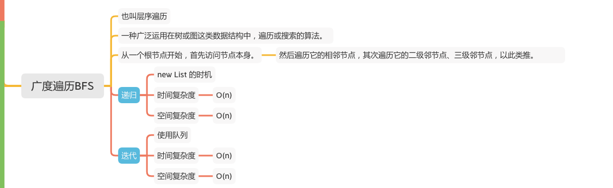

二叉树-广度遍历/层序遍历
===================

### LC 题目
#### [102. 二叉树的层序遍历](https://leetcode-cn.com/problems/binary-tree-level-order-traversal/)



### 递归

```java
    private List<List<Integer>> levels = new ArrayList<>();

    public void helper(TreeNode root, int level){
        if (levels.size() == level) {
            // 当前层没有 list，新建
            levels.add(new ArrayList<Integer>());
        }
        // 取得当前层的 list
        levels.get(level).add(root.val);
        if (root.left != null) {
            helper(root.left,level + 1);
        }
        if (root.right != null) {
            helper(root.right,level + 1);
        }
    }

```

### 迭代
```java
    public List<List<Integer>> useStack(TreeNode root) {
        List<List<Integer>> ret = new ArrayList<>();
        if (root == null) {
            return ret;
        }

        Queue<TreeNode> queue = new LinkedList<TreeNode>();
        queue.offer(root);
        while (!queue.isEmpty()) {
            List<Integer> list = new ArrayList<>();
            int levelSize = queue.size();
            for (int i = 1; i <= levelSize; i++) {
                // 推出
                TreeNode node = queue.poll();
                // 加入 list
                list.add(node.val);
                if (node.left != null) {
                    // 左结点有加入
                    queue.offer(node.left);
                }
                if (node.right != null) {
                    // 右结点有加入
                    queue.offer(node.right);
                }
            }
            // 加入 list
            ret.add(list);
        }

        return ret;
    }
```