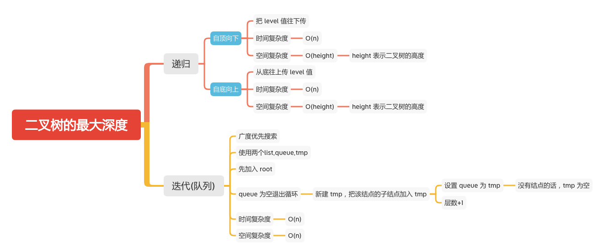

二叉树的最大深度
=============

### LC题目
#### [104. 二叉树的最大深度](https://leetcode-cn.com/problems/maximum-depth-of-binary-tree/)



### 递归

- 自顶向下
```java
    int answer = 0;

    /**
     * 自顶向下,将当前值往下传
     * @param root
     * @param depth
     */
    private static void maxDepth(TreeNode root, int depth) {
        if (root == null) {
            // 终止条件
            return;
        }
        if (root.left == null && root.right == null) {
            // 当左右结点都为空时候比较
            answer = Math.max(answer,depth);
            System.out.println(root.val + ", answer = " +answer);
        }
        maxDepth(root.left,depth+1);
        maxDepth(root.right,depth+1);
    }
```
```
9, answer = 2
15, answer = 3
7, answer = 3
```
- 自底向上
```java
    /**
     * 自底向上,从底往上传值
     * @param root
     * @return
     */
    public static int maxDepth(TreeNode root) {
       if (root == null) {
           // 终止条件，结点为空
           return 0;
       }
       int left = maxDepth(root.left);
       int right = maxDepth(root.right);
        System.out.println(root.val + ", level = " +( Math.max(left,right)  + 1));
       return Math.max(left,right)  + 1;
    }
```
```
9, level = 1
15, level = 1
7, level = 1
20, level = 2
3, level = 3
```

### 迭代
```java
    public static int maxDepth1(TreeNode root) {
        if (root == null) {
            return 0;
        }
        List<TreeNode> queue = new LinkedList<TreeNode>() {{
            add(root);
        }};
        List<TreeNode> tmp;
        int res = 0;
        while (!queue.isEmpty()) {
            tmp = new LinkedList<>();
            // 广度遍历，加入他们的左右结点
            for (int i = 0; i < queue.size(); i++) {
                TreeNode treeNode = queue.get(i);
                if (treeNode.left != null) {
                    tmp.add(treeNode.left);
                }
                if (treeNode.right != null) {
                    tmp.add(treeNode.right);
                }
            }
            res++;
            // 都没有子节点为空
            queue = tmp;
        }
        return res;
    }
```