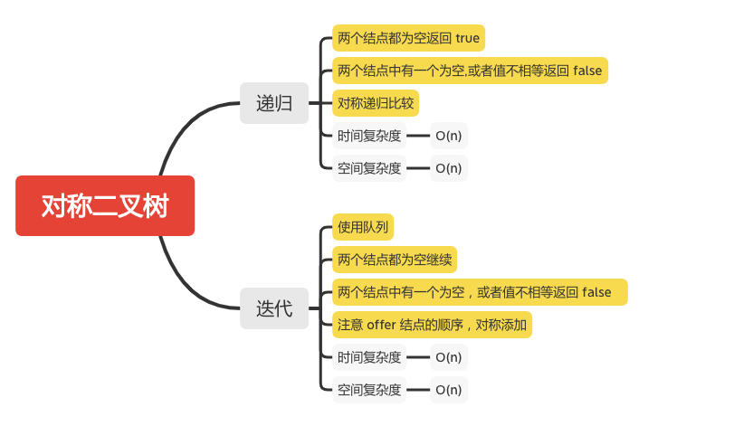

对称二叉树
========

### LC题目
#### [101. 对称二叉树](https://leetcode-cn.com/problems/symmetric-tree/)




### 递归
```java
    public boolean isSymmetric(TreeNode root) {
        return check(root, root);
    }

    public boolean check(TreeNode p, TreeNode q) {
        if (p == null && q== null) {
            // 都为空
            return true;
        }
        if (p == null || q == null || p.val != q.val) {
            // 有一个为空，或者值不相等
            return false;
        }
        return check(p.left,q.right) && check(p.right,q.left);
    }
```

### 迭代
```java
    public boolean isSymmetric(TreeNode root) {
        return check(root, root);
    }

    public boolean check(TreeNode u, TreeNode v) {
        Queue<TreeNode> q = new LinkedList<TreeNode>();
        q.offer(u);
        q.offer(v);
        while (!q.isEmpty()){
            u = q.poll();
            v = q.poll();
            if (u == null && v == null) {
                // 两个为空继续
                continue;
            }
            System.out.println("u = " + u.val + ", v = " + v.val);
            if ((u == null || v == null) || u.val != v.val) {
                // 有一个为空，或者值不相等返回 false
                return false;
            }
            // 对称添加
            q.offer(u.left);
            q.offer(v.right);

            q.offer(u.right);
            q.offer(v.left);
        }
        return true;
    }
```