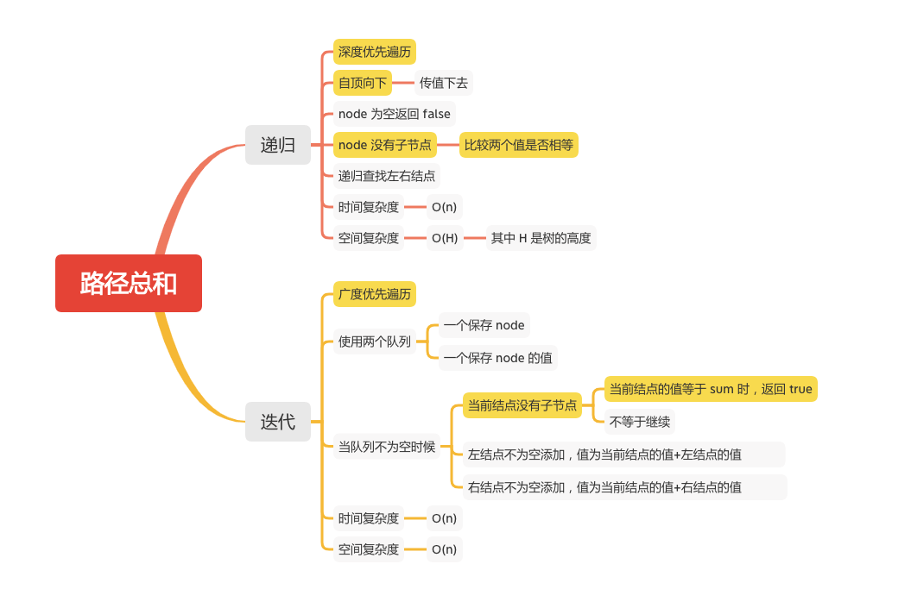

路径总和
======

### LC题目
#### [112. 路径总和](https://leetcode-cn.com/problems/path-sum/)




### 递归
```java
    public boolean hasPathSum(TreeNode root, int sum) {
        if (root == null) {
            return false;
        }
        System.out.println("val = " + root.val + ", sum = " + sum) ;
        if (root.left == null && root.right == null) {
            // 没有左右结点的时候才比较
            return root.val == sum;
        }

        // sum减去当前值，遍历到最后查看是否存在相等的值
        return hasPathSum(root.left,sum - root.val) || hasPathSum(root.right,sum - root.val);
    }
```
```
val = 1, sum = 26
val = 2, sum = 25
val = 4, sum = 23
val = 8, sum = 19
val = 16, sum = 11
val = 9, sum = 19
val = 5, sum = 23
val = 10, sum = 18
val = 11, sum = 18
val = 3, sum = 25
val = 6, sum = 22
val = 12, sum = 16
val = 13, sum = 16
val = 7, sum = 22
val = 14, sum = 15
val = 15, sum = 15
```
### 迭代
```java
    public boolean hasPathSum1(TreeNode root, int sum) {
        if (root == null) {
            return false;
        }
        Queue<TreeNode> queNode = new LinkedList<TreeNode>();
        Queue<Integer> queVal = new LinkedList<Integer>();
        queNode.offer(root);
        queVal.offer(root.val);
        while (!queNode.isEmpty()) {
            TreeNode node = queNode.poll();
            int val = queVal.poll();
            if (node.left == null && node.right == null) {
                // 没有左右结点的时候才比较
                System.out.println("node.val = " + node.val + ", val = " + val +  ", sum = " + sum) ;
                if (val == sum) {
                    return true;
                }
                continue;
            }
            if (node.left != null) {
                queNode.offer(node.left);
                queVal.offer(val + node.left.val);
            }
            if (node.right != null) {
                queNode.offer(node.right);
                queVal.offer(val + node.right.val);
            }
        }
        return false;
    }
```
```
node.val = 9, val = 16, sum = 26
node.val = 10, val = 18, sum = 26
node.val = 11, val = 19, sum = 26
node.val = 12, val = 22, sum = 26
node.val = 13, val = 23, sum = 26
node.val = 14, val = 25, sum = 26
node.val = 15, val = 26, sum = 26
```