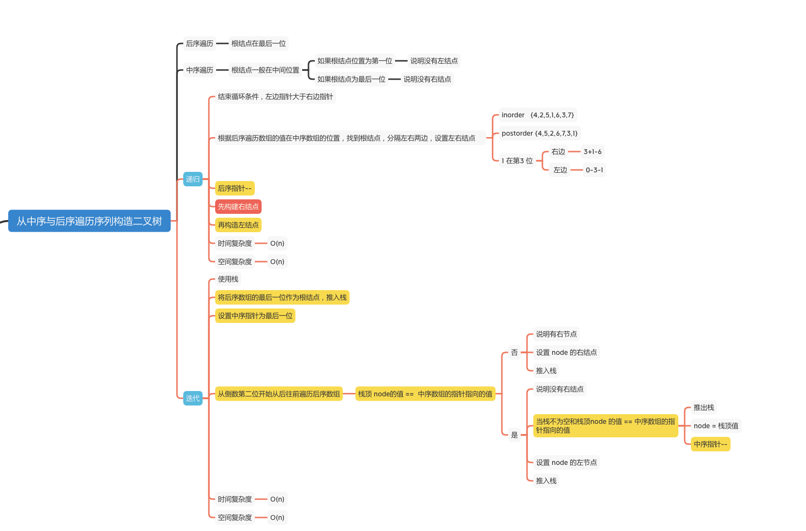
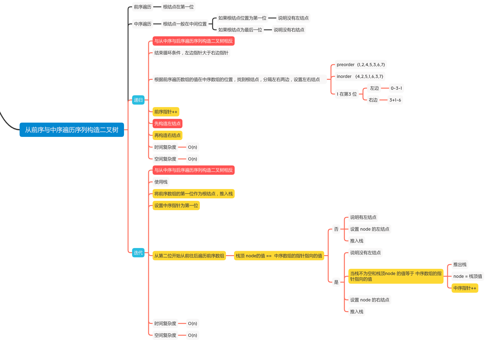
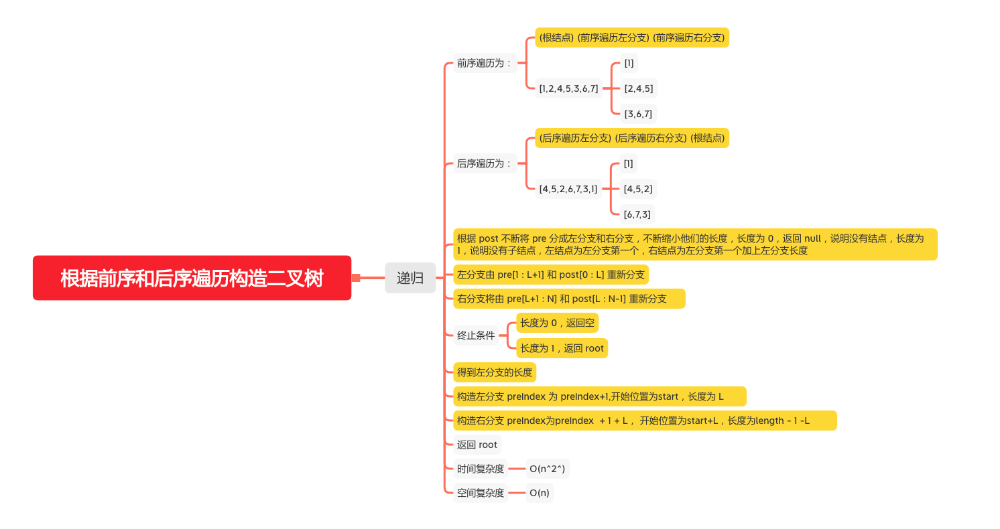

构造二叉树
========

### LC题目
#### [106. 从中序与后序遍历序列构造二叉树](https://leetcode-cn.com/problems/construct-binary-tree-from-inorder-and-postorder-traversal/)

#### [105. 从前序与中序遍历序列构造二叉树](https://leetcode-cn.com/problems/construct-binary-tree-from-preorder-and-inorder-traversal/)

#### [889. 根据前序和后序遍历构造二叉树](https://leetcode-cn.com/problems/construct-binary-tree-from-preorder-and-postorder-traversal/)

> 前序和中序、中序和后序构造的二叉树唯一， 前序+后序无法构造唯一的二叉树，有多种可能







### 递归

####  从中序与后序遍历序列构造二叉树
```java
    int post_idx;
    int[] postorder;
    int[] inorder;
    Map<Integer, Integer> idx_map = new HashMap<Integer, Integer>();

    public TreeNode buildTree(int[] inorder, int[] postorder) {
        this.postorder = postorder;
        this.inorder = inorder;
        // 从后序遍历的最后一个元素开始
        post_idx = postorder.length - 1;

        // 建立（元素，下标）键值对的哈希表
        int idx = 0;
        for (Integer val : inorder) {
            idx_map.put(val, idx++);
        }

        return helper(0, inorder.length - 1);
    }

    public TreeNode helper(int in_left, int in_right) {
        // 结束循环条件，左边指针大于右边指针
        if (in_left > in_right) {
            return null;
        }
        int nodeVal = postorder[post_idx];
        TreeNode node = new TreeNode(nodeVal);
        int index = idx_map.get(nodeVal);
        // 后序指针--
        post_idx--;
        // 先构建右结点
        node.right = helper(index + 1, in_right);
        // 再构造左结点
        node.left = helper(in_left, index - 1);
        return node;
    }
```

#### 从前序与中序遍历序列构造二叉树
```java
    int pre_idx;
    int[] preorder;
    int[] inorder;
    Map<Integer, Integer> idx_map = new HashMap<Integer, Integer>();

    public TreeNode buildTree(int[] preorder, int[] inorder) {
        this.preorder = preorder;
        this.inorder = inorder;
        // 从前序遍历的第一个元素开始
        pre_idx = 0;

        // 建立（元素，下标）键值对的哈希表
        int idx = 0;
        for (Integer val : inorder) {
            idx_map.put(val, idx++);
        }

        return helper(0, inorder.length - 1);
    }

    public TreeNode helper(int in_left, int in_right) {
        // 如果这里没有节点构造二叉树了，就结束
        if (in_left > in_right) {
            return null;
        }

        // 选择 pre_idx 位置的元素作为当前子树根节点
        int root_val = preorder[pre_idx];
        TreeNode root = new TreeNode(root_val);

        // 根据 root 所在位置分成左右两棵子树
        int index = idx_map.get(root_val);

        // 下标++
        pre_idx++;
        // 先构造左子树
        root.left = helper(in_left, index - 1);
        // 再构造右子树
        root.right = helper(index + 1, in_right);

        return root;
    }

```

#### 根据前序和后序遍历构造二叉树
```java
    int[] pre, post;

    public TreeNode constructFromPrePost(int[] pre, int[] post) {
        this.pre = pre;
        this.post = post;
        return make(0, 0, pre.length);
    }

    public TreeNode make(int preIndex, int start, int length) {
        // 长度为 0，返回空
        if (length == 0) {
            return null;
        }
        TreeNode root = new TreeNode(pre[preIndex]);
        // 长度为 1，结束递归
        if (length == 1) {
            return root;
        }
        int L = 1;
        // 求得左分支的长度
        for (; L < length; L++) {
            if (post[start + L - 1] == pre[preIndex + 1]) {
                break;
            }
        }
        // 构造左分支 开始位置为start，长度为 L
        root.left = make(preIndex + 1,start,L);
        // 构造右分支 开始位置为start+L，长度为length - 1 -L
        root.right = make(preIndex + L + 1,start+L,length - 1 -L);
        return root;
    }
```

### 迭代

#### 从中序与后序遍历序列构造二叉树
```java
    public TreeNode buildTree2(int[] inorder, int[] postorder) {
        if (postorder == null || postorder.length == 0) {
            return null;
        }
        // 根据后序数组，新建根结点
        TreeNode root = new TreeNode(postorder[postorder.length - 1]);
        Deque<TreeNode> stack = new LinkedList<TreeNode>();
        // 推入根结点
        stack.push(root);
        int inIndex = inorder.length - 1;

        // inorder   {4,2,5,1,6,3,7}
        // postorder {4,5,2,6,7,3,1}

        // 两个数组都从后往前
        for (int i = postorder.length - 2; i >= 0; i--) {

            // 取得后序遍历的值
            int postVal = postorder[i];

            System.out.println("postVal = " + postVal);

            // 取得栈顶
            TreeNode node = stack.peek();

            System.out.println("node.val = " + node.val + ", inVal = " + inorder[inIndex]);

            if (node.val != inorder[inIndex]) {
                // 当前结点不等于中序的位置，说明当前结点有右结点
                // 设置右结点
                node.right = new TreeNode(postVal);
                // 推入
                stack.push(node.right);
            } else {
                // 当前结点等于中序的位置，说明当前结点没有右结点了。
                while (!stack.isEmpty() && stack.peek().val == inorder[inIndex]) {
                    // 栈不为空，栈顶的 node 的值等于中序数组位置的值
                    System.out.println("stack.peek().val = " + stack.peek().val + ", inVal = " + inorder[inIndex]);
                    // 推出
                    node = stack.pop();
                    // 中序数组的下标位置-1
                    inIndex--;
                }
                System.out.println("node.val = " + node.val);
                // 设置左结点
                node.left = new TreeNode(postVal);
                // 推入
                stack.push(node.left);
            }
        }
        return root;
    }
```

```
postVal = 3
node.val = 1, inVal = 7
postVal = 7
node.val = 3, inVal = 7
postVal = 6
node.val = 7, inVal = 7
stack.peek().val = 7, inVal = 7
stack.peek().val = 3, inVal = 3
node.val = 3
postVal = 2
node.val = 6, inVal = 6
stack.peek().val = 6, inVal = 6
stack.peek().val = 1, inVal = 1
node.val = 1
postVal = 5
node.val = 2, inVal = 5
postVal = 4
node.val = 5, inVal = 5
stack.peek().val = 5, inVal = 5
stack.peek().val = 2, inVal = 2
node.val = 2
```

#### 从前序与中序遍历序列构造二叉树

```java
    public TreeNode buildTree2(int[] preorder, int[] inorder) {
        if (inorder == null || inorder.length == 0) {
            return null;
        }
        TreeNode root = new TreeNode(preorder[0]);
        Deque<TreeNode> stack = new LinkedList<TreeNode>();
        stack.push(root);
        int inorderIndex = 0;
        // inorder   {4,2,5,1,6,3,7}
        // preorder  {1,2,4,5,3,6,7}
        for (int i = 1; i < preorder.length; i++) {
            int preVal = preorder[i];
            TreeNode node = stack.peek();
            if (node.val != inorder[inorderIndex]) {
                // 当前结点不等于中序的位置，说明当前结点有左结点
                // 设置左结点
                node.left = new TreeNode(preVal);
                // 推入
                stack.push(node.left);
            } else {
                // 当前结点等于中序的位置，说明当前结点没有左结点了。
                while (!stack.isEmpty() && stack.peek().val == inorder[inorderIndex]) {
                    // 栈不为空，栈顶的 node 的值等于中序数组位置的值
                    // 推出
                    node = stack.pop();
                    // 中序数组的下标位置+1
                    inorderIndex++;
                }
                node.right = new TreeNode(preVal);
                stack.push(node.right);
            }
        }
        return root;
    }
```

```
preVal = 2
node.val = 1, inVal = 4
preVal = 4
node.val = 2, inVal = 4
preVal = 5
node.val = 4, inVal = 4
stack.peek().val = 4, inVal = 4
stack.peek().val = 2, inVal = 2
node.val = 2
preVal = 3
node.val = 5, inVal = 5
stack.peek().val = 5, inVal = 5
stack.peek().val = 1, inVal = 1
node.val = 1
preVal = 6
node.val = 3, inVal = 6
preVal = 7
node.val = 6, inVal = 6
stack.peek().val = 6, inVal = 6
stack.peek().val = 3, inVal = 3
node.val = 3
```