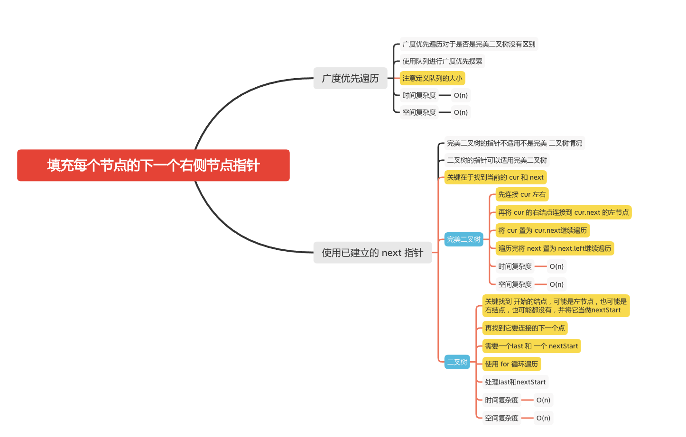

填充每个节点的下一个右侧节点指针
===========================

### LC题目
#### [116. 填充每个节点的下一个右侧节点指针](https://leetcode-cn.com/problems/populating-next-right-pointers-in-each-node/)

#### [117. 填充每个节点的下一个右侧节点指针 II](https://leetcode-cn.com/problems/populating-next-right-pointers-in-each-node-ii/)



### 迭代

```java
    public Node connect(Node root) {
        if (root == null) {
            return null;
        }
        Deque<Node> queue = new LinkedList<Node>() {{
            offer(root);
        }};
        while (!queue.isEmpty()) {
            // 注意定义队列的大小
            int size = queue.size();
            Node last =  null;
            // 广度遍历，加入他们的左右结点
            for (int i = 0; i < size; i++) {
                Node treeNode = queue.poll();
                if (treeNode.left != null) {
                    queue.offer(treeNode.left);
                }
                if (treeNode.right != null) {
                    queue.add(treeNode.right);
                }
                if (i != 0 ){
                    last.next = treeNode;
                }
                last = treeNode;
            }
        }
        return root;
    }
```

### 使用已建立的 next 指针
####  完美二叉树
```java
    public Node connect(Node root) {
        if (root == null) {
            return root;
        }
        Node next = root;
        while (next.left != null) {
            Node cur = next;
            while (cur != null) {
                // 先连接 cur 左右
                cur.left.next = cur.right;
                if (cur.next != null) {
                    //再将 cur 的右结点连接到 cur.next 的左节点
                    cur.right.next = cur.next.left;
                }
                // 将 cur 置为 cur.next
                cur = cur.next;
            }
            // next 置为 next.left
            next = next.left;
        }
        return root;
    }
```
####  二叉树
```java
    Node last = null, nextStart = null;

    public Node connect3(Node root) {
        if (root == null) {
            return null;
        }
        Node start = root;
        while (start != null) {
            // 置空最近
           last = null;
           // 置空下一个开始
           nextStart = null;
           for (Node p = start; p.next != null; p  = p.next) {
               if (p.left != null) {
                   handle(p.left);
               }
               if (p.right != null) {
                   handle(p.right);
               }
           }
           start = nextStart;
        }
        return root;
    }

    public void handle(Node p) {
        if (last != null) {
            // 最近不为空
            last.next = p;
        }
        if (nextStart == null) {
            // 下一个开始为空
            nextStart = p;
        }
        last = p;
    }
```