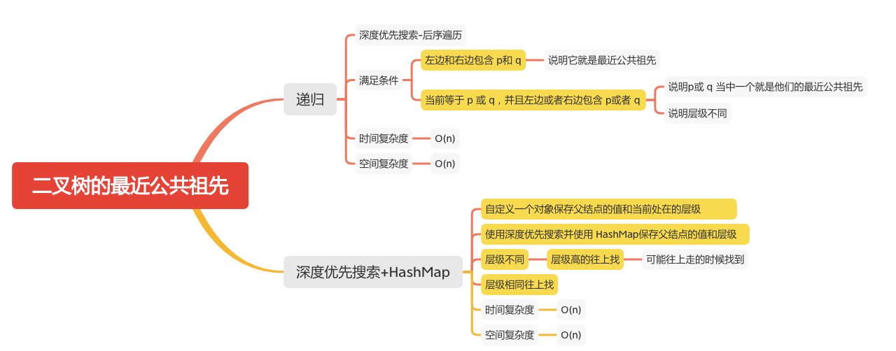

二叉树的最近公共祖先
=================

### LC题目
#### [236. 二叉树的最近公共祖先](https://leetcode-cn.com/problems/lowest-common-ancestor-of-a-binary-tree/)




### 递归
- 深度优先搜索-后序遍历
```java
    private TreeNode ans;


    private boolean dfs(TreeNode root, TreeNode p, TreeNode q) {
        if (root == null) {
            return false;
        }
        boolean lson = dfs(root.left,p,q);
        boolean rson = dfs(root.right,p,q);
        // 左边和右边包含 p和 q
        // 当前等于 p 或 q，并且左边或者右边包含 p或者 q
        if ((lson && rson) || (root.val == q.val || root.val == p.val) && (lson || rson)) {
            ans = root;
        }
        System.out.println("val = " + root.val + ", lson = " + lson + ", rson = " + rson);
        return lson || rson || (root.val == q.val || root.val == p.val);
    }

    public TreeNode lowestCommonAncestor4(TreeNode root, TreeNode p, TreeNode q) {
        this.dfs(root, p, q);
        return ans;
    }

```
```
[3,5,1,6,2,0,8,null,null,7,4]
7
4
val = 6, lson = false, rson = false
val = 7, lson = false, rson = false
val = 4, lson = false, rson = false
val = 2, lson = true, rson = true
val = 5, lson = false, rson = true
val = 0, lson = false, rson = false
val = 8, lson = false, rson = false
val = 1, lson = false, rson = false
val = 3, lson = true, rson = false
```

### 深度优先搜索+HashMap
```java
    public static class TreeNodeAndLevel {
        int parentVal;
        int level;

        public TreeNodeAndLevel(int parentVal, int level) {
            this.parentVal = parentVal;
            this.level = level;
        }
    }


    Map<Integer, TreeNodeAndLevel> map;

    public void dfs(TreeNode root, int level) {
        if (root.left != null) {
            map.put(root.left.val, new TreeNodeAndLevel(root.val, level + 1));
            dfs(root.left, level + 1);
        }
        if (root.right != null) {
            map.put(root.right.val, new TreeNodeAndLevel(root.val, level + 1));
            dfs(root.right, level + 1);
        }
    }

    public TreeNode lowestCommonAncestor1(TreeNode root, TreeNode p, TreeNode q) {
        TreeNode treeNode = null;
        if (root == null) {
            return treeNode;
        }
        map = new HashMap<>();
        map.put(root.val, new TreeNodeAndLevel(root.val, 0));
        int pVal = p.val;
        int qVal = q.val;
        dfs(root, 0);
        TreeNodeAndLevel pTL = map.get(pVal);
        TreeNodeAndLevel qTL = map.get(qVal);
        // 有一个为空
        if (pTL == null || qTL == null) {
            return treeNode;
        }
        if (qTL.level != pTL.level) {
            // 层级不同,层级高的往上找
            if (pTL.level < qTL.level) {
                while (qTL.level != pTL.level) {
                    if (qTL.parentVal == pVal) {
                        return p;
                    }
                    qTL = map.get(qTL.parentVal);
                }

            } else {
                while (pTL.level != qTL.level) {

                    if (pTL.parentVal == qVal) {
                        return q;
                    }
                    pTL = map.get(pTL.parentVal);
                }
            }
        }
        // 层级相同往上找
        while (pTL.parentVal != qTL.parentVal) {
            pTL = map.get(pTL.parentVal);
            qTL = map.get(qTL.parentVal);
        }
        return new TreeNode(pTL.parentVal);
    }
```

