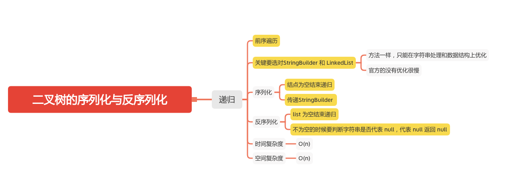

二叉树的序列化与反序列化
====================


### LC-题目
#### [297. 二叉树的序列化与反序列化](https://leetcode-cn.com/problems/serialize-and-deserialize-binary-tree/)



### 递归

```java
    String SEP = ",";

    // Encodes a tree to a single string.
    public String serialize(TreeNode root) {

        StringBuilder sb = new StringBuilder();
        serialize(root, sb);
        return sb.toString();

    }

    public void serialize(TreeNode root, StringBuilder sb) {
        if (root == null) {
            // 结点为空结束递归
            sb.append("null").append(SEP);
            return;
        }
        sb.append(root.val).append(SEP);
        serialize(root.left, sb);
        serialize(root.right, sb);
    }

    // Decodes your encoded data to tree.
    public TreeNode deserialize(String data) {
        LinkedList<String> list = new LinkedList<>();
        for (String node : data.split(SEP)) {
            list.offer(node);
        }
        return deserialize(list);


    }

    public TreeNode deserialize(LinkedList<String> list) {
        if (list.isEmpty()) {
            // list 为空结束递归
            return null;
        }
        String val = list.removeFirst();
        if ("null".equals(val)) {
            // 不为空的时候要判断字符串是否代表 null，代表 null 返回 null
            return null;
        }
        TreeNode root = new TreeNode(Integer.parseInt(val));
        root.left = deserialize(list);
        root.right = deserialize(list);
        return root;
    }
```