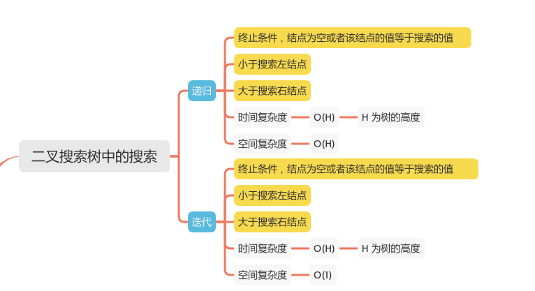
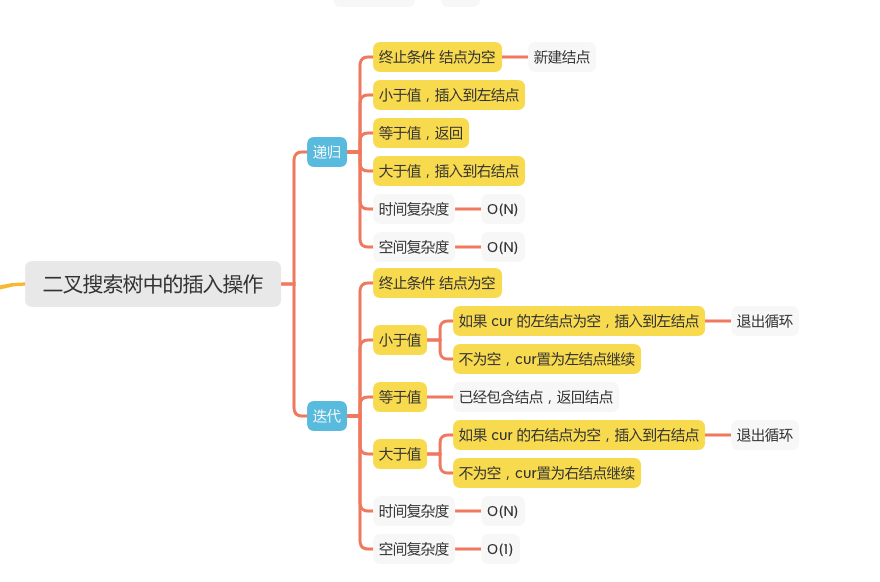
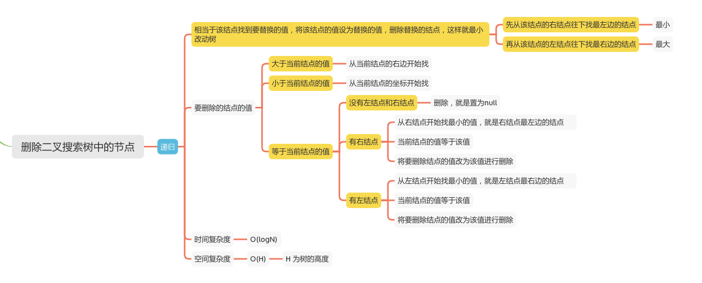

二叉搜索树的查找、插入、删除
=======================

### LC题目
#### [700. 二叉搜索树中的搜索](https://leetcode-cn.com/problems/search-in-a-binary-search-tree/)

#### [701. 二叉搜索树中的插入操作](https://leetcode-cn.com/problems/insert-into-a-binary-search-tree/)

#### [450. 删除二叉搜索树中的节点](https://leetcode-cn.com/problems/delete-node-in-a-bst/)







### 二叉搜索树中的搜索

#### 递归
```java
        public TreeNode searchBST(TreeNode root, int val) {
            if (root == null || val == root.val){
                // 终止条件，结点为空或者该结点的值等于搜索的值
                return root;
            }
            // 小于搜索左结点 大于搜索右结点
            return val < root.val ? searchBST(root.left, val) : searchBST(root.right, val);
        }
```

### 迭代
```java
        public TreeNode searchBST(TreeNode root, int val) {
            // 终止条件，结点为空或者该结点的值等于搜索的值
            while (root != null && val != root.val){
                // 小于搜索左结点 大于搜索右结点
                root = val < root.val ? root.left : root.right;
            }

            return root;
        }
```

### 二叉搜索树中的插入操作

#### 递归
```java
        public TreeNode insertIntoBST(TreeNode root, int val) {
            if (root == null) {
                // 终止条件 结点为空 新建结点
                return new TreeNode(val);
            }
            if (val < root.val) {
                // 小于值，插入到左结点
                root.left = insertIntoBST(root.left, val);
            } else if (val == root.val) {
                // 等于值，返回
                return root;
            } else {
                // 大于值，插入到右结点
                root.right = insertIntoBST(root.right, val);
            }
            return root;
        }
```

### 迭代
```java
        public TreeNode insertIntoBST(TreeNode root, int val) {
            if (root == null)
                return new TreeNode(val);
            TreeNode cur = root;
            while (cur != null) {
                if (cur.val > val) {
                    if (cur.left == null) {
                        // 如果 cur 的左结点为空，插入到左结点
                        cur.left = new TreeNode(val);
                        break;
                    }
                    // 不为空，cur置为左结点继续
                    cur = cur.left;
                } else if (cur.val == val) {
                    // 已经包含结点，返回结点
                    return root;
                } else {
                    if (cur.right == null) {
                        // 如果 cur 的右结点为空，插入到右结点
                        cur.right = new TreeNode(val);
                        break;
                    }
                    // 不为空，cur置为右结点继续
                    cur = cur.right;
                }
            }
            return root;
        }
```

### 删除二叉搜索树中的节点
#### 递归
```java
        /**
         * 从该结点的右结点开始找最小的
         * @param root
         * @return
         */
        public int findRightMin(TreeNode root) {
            root = root.right;
            while (root.left != null)
                root = root.left;
            return root.val;
        }
        /**
         * 从该结点的左结点开始找最大的
         * @param root
         * @return
         */
        public int findLeftMax(TreeNode root) {
            root = root.left;
            while (root.right != null)
                root = root.right;
            return root.val;
        }

        public TreeNode deleteNode(TreeNode root, int key) {
            if (root == null)
                return null;
            System.out.println("root.val" + root.val);

            if (key > root.val) {
                // delete from the right subtree
                // 从右边子树开始删除
                root.right = deleteNode(root.right, key);
            } else if (key < root.val) {
                // delete from the left subtree
                // 从左边子树开始删除
                root.left = deleteNode(root.left, key);
            } else {
                // delete the current node
                // 删除当前结点
                if (root.left == null && root.right == null) {
                    // 没有结点置空
                    // the node is a leaf
                    root = null;
                } else if (root.right != null) {
                    // the node is not a leaf and has a right child
                    // 右边有结点，找到右边最小值，也就是右结点的值，或者右结点最左边的值
                    root.val = findRightMin(root);
                    root.right = deleteNode(root.right, root.val);
                } else {
                    // the node is not a leaf, has no right child, and has a left child
                    // 左边有结点，找到左边最大值，也就是左结点的值，或者左结点最右边的值
                    root.val = findLeftMax(root);
                    root.left = deleteNode(root.left, root.val);
                }
            }
            return root;
        }

    }


```