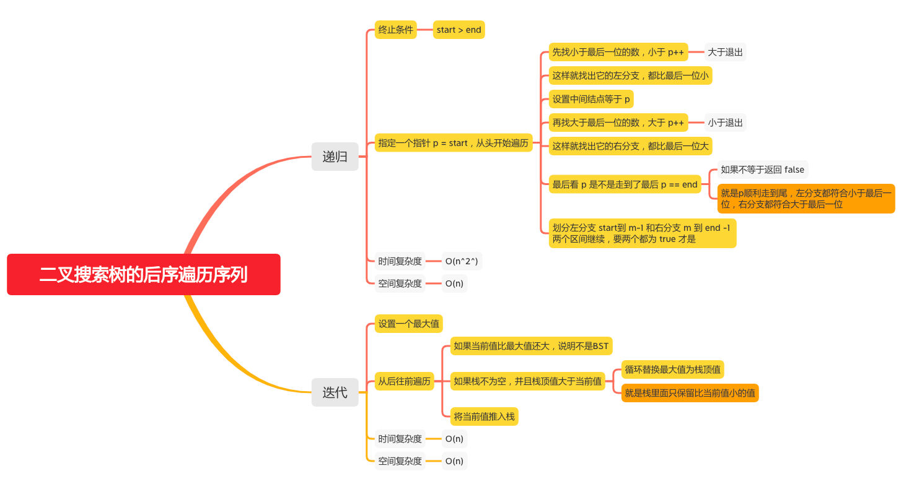

前序遍历数组、后序遍历数组验证二叉搜索树
================================

#### [剑指 Offer 33. 二叉搜索树的后序遍历序列](https://leetcode-cn.com/problems/er-cha-sou-suo-shu-de-hou-xu-bian-li-xu-lie-lcof/)

#### [255. 验证前序遍历序列二叉搜索树](https://leetcode-cn.com/problems/verify-preorder-sequence-in-binary-search-tree/)




### 后序遍历数组验证二叉搜索树
#### 递归
```java
    public boolean verifyPostorder(int[] postorder) {
        return recur(postorder, 0, postorder.length - 1);
    }

    boolean recur(int[] postorder, int start, int end) {
       if (start >=end) {
           return true;
       }
       int p = start;
       while (postorder[p] < postorder[end]) {
           // 先找小于最后一位的数，小于 p++
           p++;
       }
       // 设置中间结点等于 p
       int mid = p;
       while (postorder[p] > postorder[end]) {
           // 再找大于最后一位的数，大于 p++
           p++;
       }
       // 最后看 p 是不是走到了最后 p == end
       // 就是p顺利走到尾，左分支都符合小于最后一位，右分支都符合大于最后一位
       if (p != end) {
           // 如果不等于返回 false
           return false;
       }
       // 划分左分支 start到 m-1 和右分支 m 到 end -1 两个区间继续，要两个都为 true 才是 
       return recur(postorder,start,mid-1) && recur(postorder,mid,end -1);
    }
```

#### 迭代
```java
    public boolean verifyPostorder(int[] postorder) {
        Stack<Integer> stack = new Stack<>();
        // 设置一个最大值
        int max = Integer.MAX_VALUE;
        for (int i = postorder.length -1 ; i >= 0; i--) {
            if (postorder[i] > max) {
                // 如果当前值比最大值还大，说明不是BST
                return false;
            }
            // 如果栈不为空，并且栈顶值大于当前值
            while (!stack.isEmpty() && stack.peek() > postorder[i]) {
                // 循环替换最大值为栈顶值
                // 就是栈里面只保留比当前值小的值
                max = stack.pop();
            }
            // 将当前值推入栈
            stack.push(postorder[i]);
        }
        return true;
    }
```

### 前序遍历数组验证二叉搜索树
```java
    public boolean verifyPreorder(int[] preorder) {
        if (preorder == null) {
            return true;
        }
        int[] stack = new int[preorder.length];
        // 设置一个最小值
        int min = Integer.MIN_VALUE;
        int top = -1;
        for (int i = 0; i < preorder.length; i++) {
            if (preorder[i] < min){
                // 如果当前值比最小值还大，说明不是BST
                return false;
            }
            // 如果栈不为空，并且栈顶值小于当前值
            while (top != -1 && preorder[i] > stack[top]) {
                //  循环替换最小值为栈顶值
                // 就是栈里面只保留比当前值大的值
                min = stack[top];
                top--;
            }
            // 将当前值推入栈
            stack[++top] = preorder[i];
        }
        return true;
    }
```