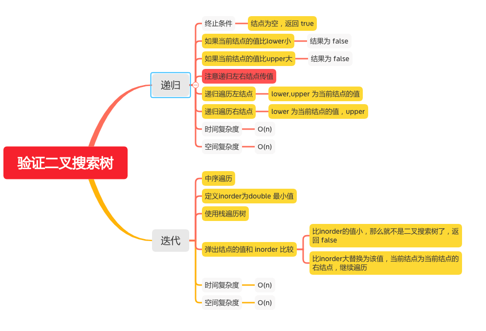

验证二叉搜索树
===========

#### [98. 验证二叉搜索树](https://leetcode-cn.com/problems/validate-binary-search-tree/)



### 递归
```java
    public boolean isValidBST(TreeNode root) {
        return helper(root, null, null);
    }

    public boolean helper(TreeNode node, Integer lower, Integer upper) {
        if (node == null) {
            // 结点为空，返回 true
            return true;
        }

        int val = node.val;
        if (lower != null && val <= lower) {
            // 如果当前结点的值比lower小
            return false;
        }
        if (upper != null && val >= upper) {
            // 如果当前结点的值比upper大
            return false;
        }
        if (!helper(node.left, lower, val)) {
            // lower,upper 为当前结点的值
            return false;
        }
        if (!helper(node.right, val, upper)) {
            // lower 为当前结点的值，upper
            return false;
        }
        return true;
    }
```

### 迭代
```java
    public boolean isValidBST(TreeNode root) {
        Deque<TreeNode> stack = new LinkedList<TreeNode>();
        // 定义inorder为double 最小值
        double inorder = -Double.MAX_VALUE;
        // 使用栈遍历树
        while (!stack.isEmpty() || root != null) {
            while (root != null) {
                stack.push(root);
                root = root.left;
            }
            root = stack.pop();
            // 弹出结点的值和 inorder 比较
            if (root.val <= inorder) {
                // 比inorder的值小，那么就不是二叉搜索树了，返回 false
                return false;
            }
            // 比inorder大替换为该值
            inorder = root.val;
            // 当前结点为当前结点的右结点
            root = root.right;
        }
        return true;
    }
```