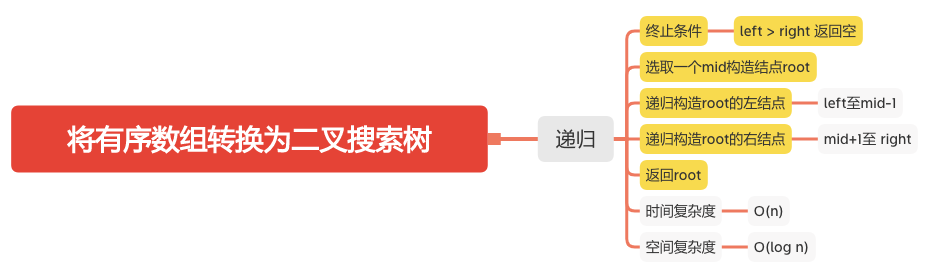
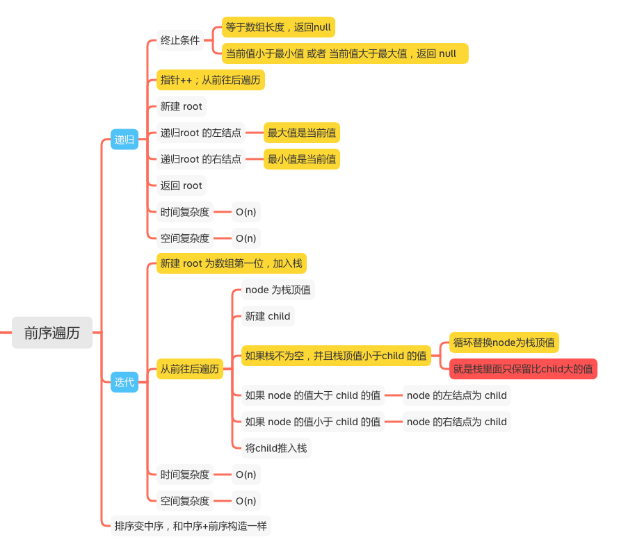
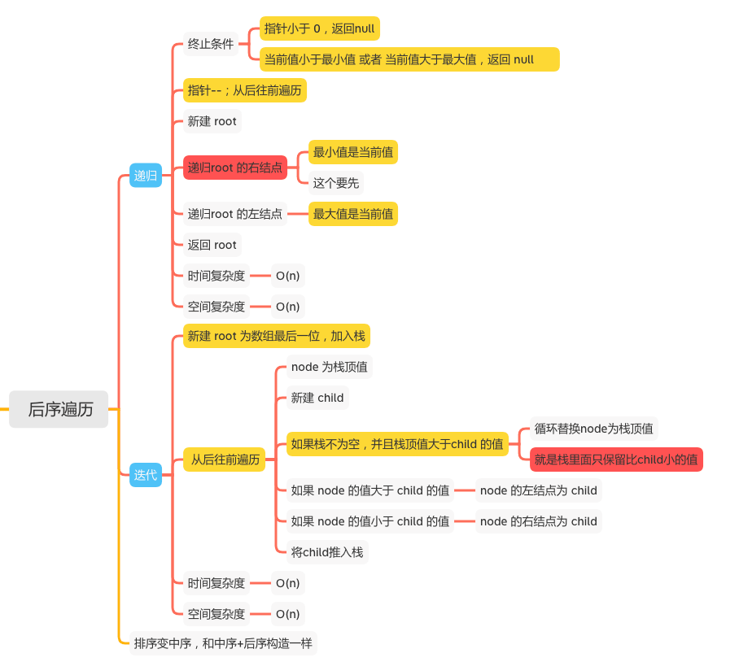

将数组转换为二叉搜索树
======================

#### [108. 将有序数组转换为二叉搜索树](https://leetcode-cn.com/problems/convert-sorted-array-to-binary-search-tree/)
#### [1008. 前序遍历构造二叉搜索树](https://leetcode-cn.com/problems/construct-binary-search-tree-from-preorder-traversal/)








## 将有序数组转换为二叉搜索树
### 递归
```java
    public TreeNode sortedArrayToBST(int[] nums) {
        if (nums == null) {
            return null;
        }
        return helper(nums, 0, nums.length - 1);
    }

    public TreeNode helper(int[] nums, int left, int right) {
        if (left > right) {
            return null;
        }
        // 选取一个mid构造结点root
        int mid = (right + left) / 2;
        TreeNode root = new TreeNode(nums[mid]);
        // 递归构造root的左结点
        root.left = helper(nums, left, mid - 1);
        // 递归构造root的右结点
        root.right = helper(nums, mid + 1, right);
        return root;
    }
```

## 前序遍历构造二叉搜索树
### 递归
```java
    int idx = 0;
    int[] preorder;
    int n;

    public TreeNode helper(int lower, int upper) {
        if (idx == n) {
            // 等于数组长度，返回null
            return null;
        }
        int val = preorder[idx];
        if (val < lower || val > upper) {
            // 当前值小于最小值 或者 当前值大于最大值，返回 null
            return null;
        }
        idx++;
        TreeNode root = new TreeNode(val);
        // 最大值是当前值
        root.left = helper(lower, val);
        // 最小值是当前值
        root.right = helper(val, upper);
        return root;

    }

    public TreeNode bstFromPreorder(int[] preorder) {
        if (preorder == null) {
            return null;
        }
        this.preorder = preorder;
        n = preorder.length;
        return helper(Integer.MIN_VALUE, Integer.MAX_VALUE);
    }
```

### 迭代
```java
    public TreeNode bstFromPreorder(int[] preorder) {
        if (preorder == null || preorder.length == 0) {
            return null;
        }
        int n = preorder.length;
        Deque<TreeNode> stack = new LinkedList<>();
        // 新建 root 为数组第一位，加入栈
        TreeNode root = new TreeNode(preorder[0]);
        stack.push(root);
        // 从前往后遍历
        for (int i = 1; i < n; i++) {
            TreeNode node = stack.peek();
            TreeNode child = new TreeNode(preorder[i]);
            // 如果栈不为空，并且栈顶值小于child 的值
            while (!stack.isEmpty() && stack.peek().val < child.val) {
                // 就是栈里面只保留比child大的值
                // 循环替换node为栈顶值
                node = stack.pop();
            }
            if (child.val < node.val) {
                node.left = child;
            } else {
                node.right = child;
            }
            // 将child推入栈
            stack.push(child);
        }
        return root;
    }
```

## 后序遍历构造二叉搜索树
### 递归
```java
    int idx = 0;
    int[] postorder;
    
    public TreeNode bstFromPostorder(int[] postorder) {
        this.postorder = postorder;
        idx = postorder.length - 1;
        return helper(Integer.MIN_VALUE, Integer.MAX_VALUE);
    }

    public TreeNode helper(int lower, int upper) {
        if (idx < 0) {
            // 指针小于 0，返回null
            return null;
        }
        int val = postorder[idx];
        if (val < lower || val > upper) {
            // 当前值小于最小值 或者 当前值大于最大值，返回 null
            return null;
        }
        idx--;
        // 先递归root 的右结点
        TreeNode root = new TreeNode(val);
        root.right = helper(val, upper);
        root.left = helper(lower, val);
        return root;
    }
```

### 迭代
```java
    public TreeNode bstFromPostorder(int[] postorder) {
        if (postorder == null || postorder.length == 0) {
            return null;
        }
        Deque<TreeNode> stack = new LinkedList<>();
        // 新建 root 为数组最后一位，加入栈
        TreeNode root = new TreeNode(postorder[postorder.length - 1]);
        stack.push(root);
        //  从后往前遍历
        for (int i = postorder.length - 2; i >= 0; i--) {
            TreeNode node = stack.peek();
            TreeNode child = new TreeNode(postorder[i]);
            // 如果栈不为空，并且栈顶值大于child 的值
            while (!stack.isEmpty() && stack.peek().val > child.val) {
                // 就是栈里面只保留比child小的值
                // 循环替换node为栈顶值
                node = stack.pop();
            }
            if (child.val < node.val) {
                node.left = child;
            } else {
                node.right = child;
            }
            // 将child推入栈
            stack.push(child);
        }
        return root;
    }
```