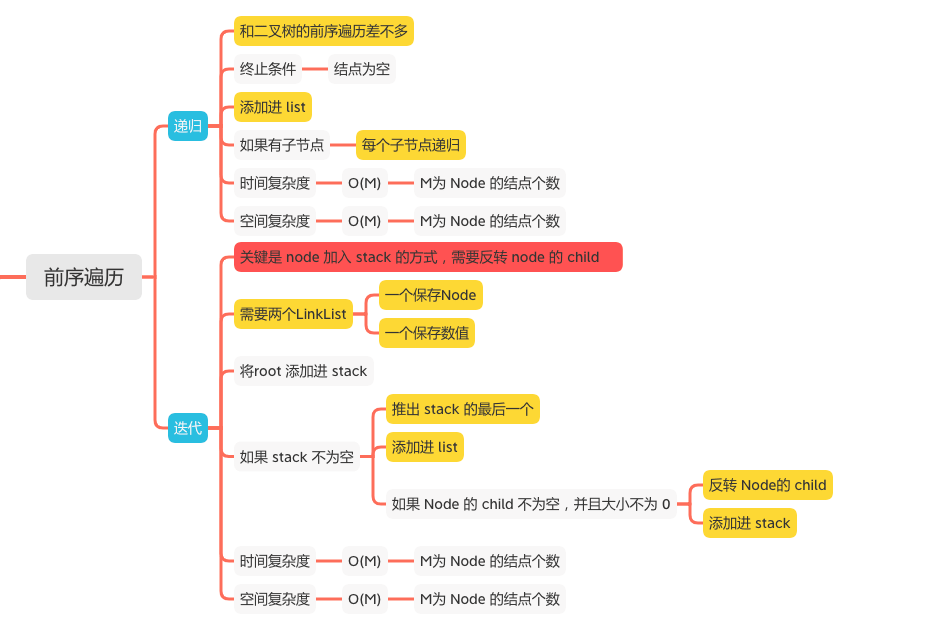
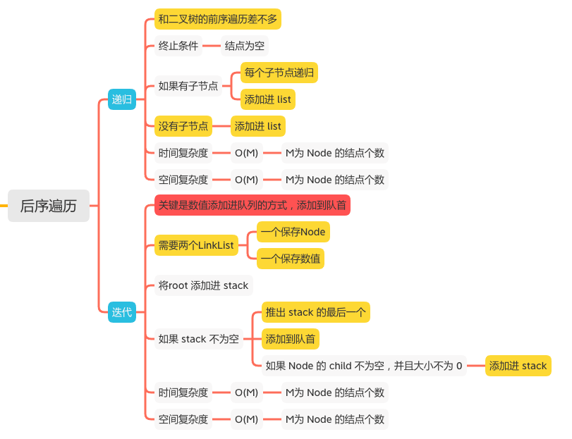

N叉树的深度遍历DFS
================

#### [589. N叉树的前序遍历](https://leetcode-cn.com/problems/n-ary-tree-preorder-traversal/)

#### [590. N叉树的后序遍历](https://leetcode-cn.com/problems/n-ary-tree-postorder-traversal/)





## N叉树的前序遍历

### 递归
```java
    List<Integer> list = new ArrayList<>();

    public List<Integer> preorder(Node root) {
        helper(root);
        return list;
    }

    public void helper(Node root) {
        if (root == null) {
            return;
        }
        list.add(root.val);
        if (root.children != null && !root.children.isEmpty()) {
            for (int i = 0; i < root.children.size(); i++) {
                helper(root.children.get(i));
            }
        }
    }
```

### 迭代
```java
    public List<Integer> preorder(Node root) {
        LinkedList<Node> stack = new LinkedList<>();
        LinkedList<Integer> output = new LinkedList<>();
        if (root == null) {
            return output;
        }
        stack.add(root);
        while (!stack.isEmpty()) {
            Node node = stack.pollLast();
            // 添加进 list
            output.add(node.val);
            if (node.children != null && !node.children.isEmpty()) {
                // 反转 Node的 child
                Collections.reverse(node.children);
                stack.addAll(node.children);
            }
        }
        return output;
    }
```

## N叉树的后序遍历
### 递归
```java
    List<Integer> list = new ArrayList<>();

    public List<Integer> postorder(Node root) {
        helper(root);
        return list;
    }

    public void helper(Node root) {
        if (root == null) {
            return;
        }
        if (root.children != null || !root.children.isEmpty()) {
            for (int i = 0; i < root.children.size(); i++) {
                helper(root.children.get(i));

            }
            list.add(root.val);
        } else {
            list.add(root.val);
        }
    }
```

### 迭代
```java
    public List<Integer> postorder(Node root) {
        LinkedList<Node> stack = new LinkedList<>();
        LinkedList<Integer> output = new LinkedList<>();
        if (root == null) {
            return output;
        }
        stack.add(root);
        while (!stack.isEmpty()) {
            Node node = stack.pollLast();
            // 添加到队首
            output.addFirst(node.val);
            if (node.children != null && !node.children.isEmpty()) {
                stack.addAll(node.children);
            }
        }
        return output;
    }
```