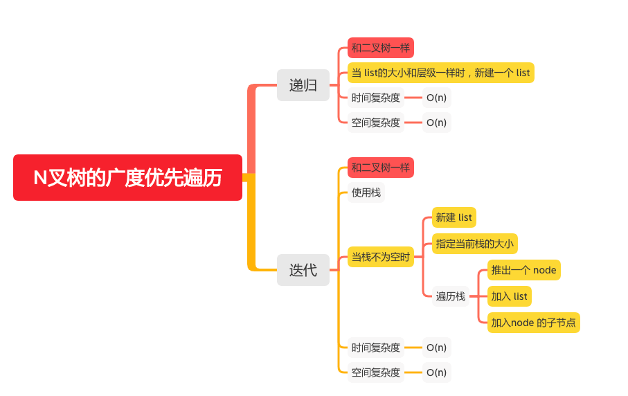

N叉树的广度优先遍历BFS
================

#### [429. N叉树的层序遍历](https://leetcode-cn.com/problems/n-ary-tree-level-order-traversal/)



### 递归
```java
    List<List<Integer>> lists = new ArrayList<>();

    public List<List<Integer>> levelOrder(Node root) {
        helper(root, 0);
        return lists;
    }

    public void helper(Node root, int level) {
        if (root == null) {
            return;
        }
        if (lists.size() == level) {
            lists.add(new ArrayList<>());
        }
        lists.get(level).add(root.val);
        if (root.children != null && !root.children.isEmpty()) {
            for (int i = 0; i < root.children.size(); i++) {
                helper(root.children.get(i), level + 1);
            }
        }

    }
```

### 迭代
```java
    public List<List<Integer>> levelOrder1(Node root) {
        List<List<Integer>> lists = new ArrayList<>();
        Deque<Node> stack = new LinkedList<>();
        stack.offer(root);
        while (!stack.isEmpty()) {
            // 指定当前栈的大小
            int size = stack.size();
            List<Integer> nodeList = new ArrayList<>();
            for (int i = 0; i < size; i++) {
                // 推出一个 node
                Node node = stack.poll();
                // 加入 list
                nodeList.add(node.val);
                if (node.children != null && !node.children.isEmpty()) {
                    // 加入node 的子节点
                    stack.addAll(node.children);
                }

            }
            lists.add(nodeList);

        }
        return lists;
    }
```