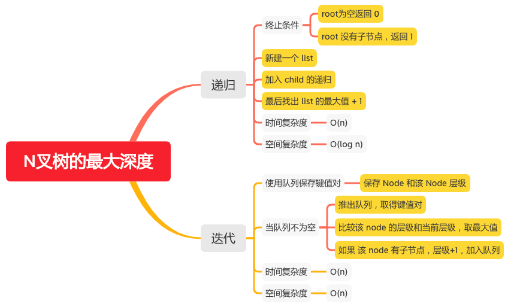

N叉树的最大深度
=============

#### [559. N叉树的最大深度](https://leetcode-cn.com/problems/maximum-depth-of-n-ary-tree/)



### 递归
```java
    public int maxDepth(Node root) {
        if (root == null) {
            // root为空返回 0
            return 0;
        } else if (root.children == null || root.children.isEmpty()) {
            // root 没有子节点，返回 1
            return 1;
        } else {
            // 新建一个 list
            List<Integer> list = new ArrayList<>();
            for (Node child : root.children) {
                // 加入 child 的递归
                list.add(maxDepth(child));
            }
            // 最后找出 list 的最大值 + 1
            return Collections.max(list) + 1;
        }
    }
```

### 迭代
```java
    public int maxDepth(Node root) {
        int depth = 0;
        if (root == null) {
            return depth;
        }
        Queue<Pair<Node, Integer>> stack = new LinkedList<>();
        // 保存 Node 和该 Node 层级
        stack.add(new Pair<Node, Integer>(root, 1));
        while (!stack.isEmpty()) {
            // 推出队列，取得键值对
            Pair<Node, Integer> pair = stack.poll();
            root = pair.getKey();
            int level = pair.getValue();
            // 比较该 node 的层级和当前层级，取最大值
            depth = Math.max(depth, level);
            if (root.children != null && !root.children.isEmpty()) {
                for (Node child : root.children) {
                    // 如果 该 node 有子节点，层级+1，加入队列
                    stack.add(new Pair<Node, Integer>(child, level + 1));
                }
            }
        }
        return depth;
    }
```