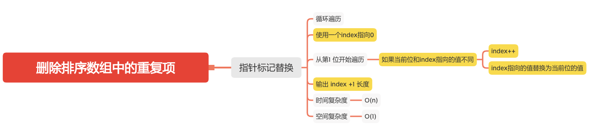

删除排序数组中的重复项
==================


#### [26. 删除排序数组中的重复项](https://leetcode-cn.com/problems/remove-duplicates-from-sorted-array/)



### 指针标记替换

```
    public int removeDuplicates(int[] nums) {
        if (nums == null || nums.length == 0) {
            return 0;
        }
        int index = 0;
        for (int i = 1; i < nums.length; i++) {
            if (nums[i] != nums[index]) {
                index++;
                // index指向的值替换为当前位的值
                nums[index] = nums[i];
            }
        }
        return index + 1;
    }
```