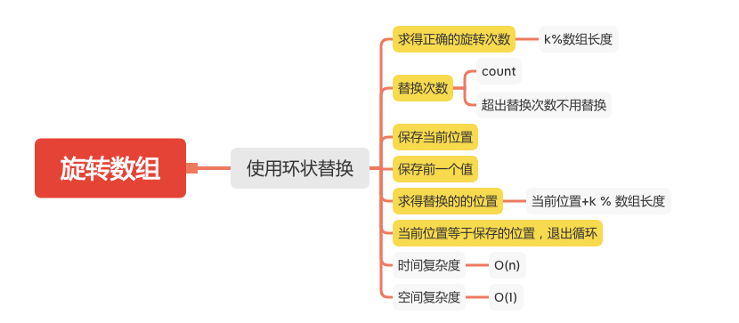

旋转数组
=======

#### [189. 旋转数组](https://leetcode-cn.com/problems/rotate-array/)



### 使用环状替换
```java
    public static int[] testRotate(int[] nums, int k) {
        if (nums == null || nums.length == 0 || k < 0) {
            return nums;
        }
        // 求得正确的旋转次数
        k = k % nums.length;
        // 替换次数
        int count = 0;
        for (int start = 0; count < nums.length; start++) {
            // 保存当前位置
            int current = start;
            // 保存前一个值
            int pre = nums[start];
            do {
                // 求得替换的的位置
                int next = (current + k) % nums.length;
                int tmp = nums[next];
                nums[next] = pre;
                pre = tmp;
                current = next;
                count++;
            }while (start != current);// 当前位置等于保存的位置，退出循环
        }
        return nums;
    }
```