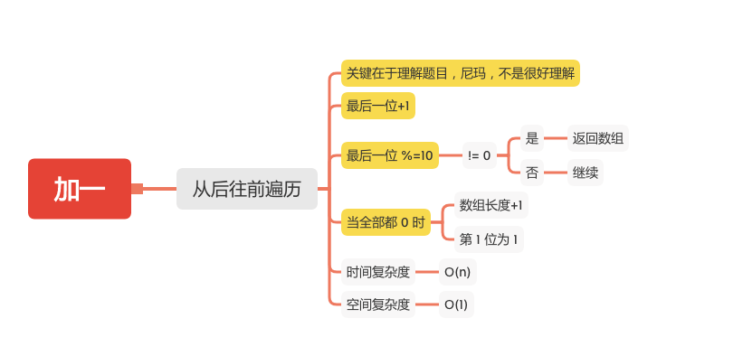

加一
===

#### [66. 加一](https://leetcode-cn.com/problems/plus-one/)



### 从后往前遍历

```java
    public int[] plusOne(int[] digits) {
        if (digits == null || digits.length == 0) {
            return new int[0];
        }
        int len = digits.length;
        for (int i = len - 1; i >= 0; i--) {
            digits[i]++;
            digits[i] %= 10;
            // 不为 0 返回，为 0 继续
            if (digits[i] != 0) {
                return digits;
            }
        }
        // 全部进位为 0 数组长度+1
        digits = new int[len + 1];
        // 第一位为 1
        digits[0] = 0;
        return digits;
    }
```