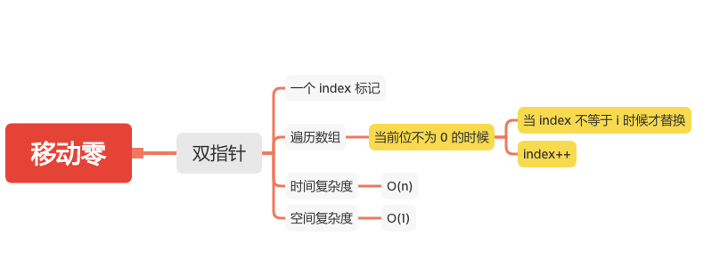

移动零
=====

#### [283. 移动零](https://leetcode-cn.com/problems/move-zeroes/)



### 双指针

```java
    public static void moveZeroes(int[] nums) {
        if (nums == null || nums.length == 0) {
            return;
        }
        int index = 0;
        for (int i = 0; i < nums.length; i++) {
            if (nums[i] != 0) {
                //当前位不为 0 的时候
                if (i != index) {
                    // 当 index 不等于 i 时候才替换
                    int tmp = nums[i];
                    nums[i] = nums[index];
                    nums[index] = tmp;
                }
                index++;
            }
        }
    }
```