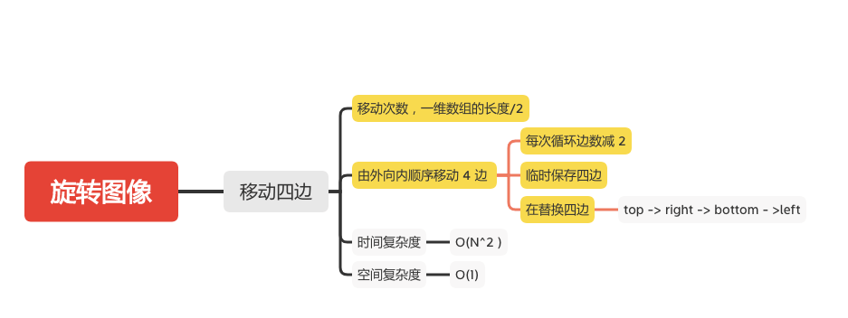

旋转图像
======

#### [48. 旋转图像](https://leetcode-cn.com/problems/rotate-image/)



### 移动四边

```java
    public static void rotate(int[][] matrix) {
        if (matrix == null || matrix.length == 0) {
            return;
        }
        int matrixLength = matrix.length;
        for (int i = 0; i < matrixLength; i++) {
            if (matrix[i].length !=  matrixLength){
                return;
            }
        }
        int count = matrixLength / 2;
        for (int i = 0; i < count; i++) {
            int length = matrixLength - 2 * i;
            int index = 0;
            int[] top = new int[length];
            int[] right = new int[length];
            int[] bottom = new int[length];
            int[] left = new int[length];
            for (int j = i; index < length; j++,index++) {
                top[index] = matrix[i][j];
                right[index] = matrix[j][matrixLength - i - 1];
                bottom[index] = matrix[matrixLength -i-1][j];
                left[index] = matrix[j][i];
            }
            index = 0;
            for (int j = i; index < length; j++,index++) {
                //  top -> right
                matrix[j][matrixLength - i - 1] = top[index];
                // right -> bottom
                matrix[matrixLength -i-1][j] = right[length - index -1];
                // bottom -> left
                matrix[j][i] = bottom[index];
                // left -> top
                matrix[i][j] = left[length - index -1];
            }
        }
    }
```