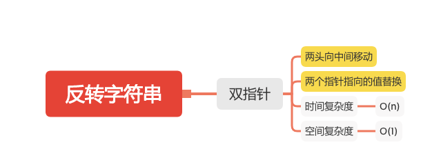

反转字符串
========

#### [344. 反转字符串](https://leetcode-cn.com/problems/reverse-string/)



### 双指针

```java
    public void reverseString(char[] s) {
        if (s == null || s.length <= 1) {
            return;
        }
        for (int left = 0, right = s.length -1; left < right; left++,right--) {
            char tmp = s[left];
            s[left] = s[right];
            s[right] = tmp;
        }
    }
```

