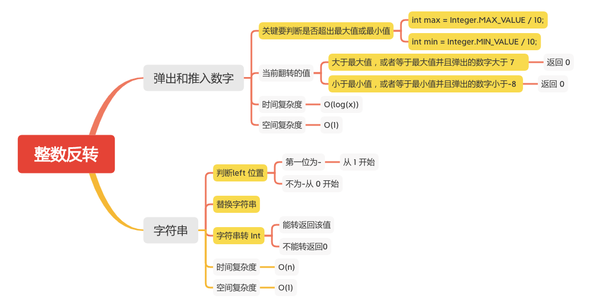

整数反转
=======

#### [7. 整数反转](https://leetcode-cn.com/problems/reverse-integer/)



### 弹出和推入数字

```java
    public static int reverse1(int x) {
        int rev = 0;
        // 最大值
        int max = Integer.MAX_VALUE / 10;
        // 最小值
        int min = Integer.MIN_VALUE / 10;
        while (x != 0) {
            int pop = x % 10;
            x /= 10;
            if (rev > max || (rev == max && pop > 7)) {
                // 大于最大值，或者等于最大值并且弹出的数字大于 7
                return 0;
            }
            if (rev < min || (rev == min && pop < -8)) {
                // 小于最小值，或者等于最小值并且弹出的数字小于-8
                return 0;
            }
            rev = rev * 10 + pop;
        }
        return rev;
    }
```

### 字符串
```java
    public static int reverse(int x) {
        String str = String.valueOf(x);
        int left = !str.startsWith("-") ? 0 : 1;
        char[] chars = str.toCharArray();

        for (int right = chars.length - 1; left < right; left++, right--) {
            char tmp = chars[left];
            chars[left] = chars[right];
            chars[right] = tmp;
        }
        str = String.valueOf(chars);
        try {
            x = Integer.parseInt(str);
            return x;
        } catch (NumberFormatException e) {
            e.printStackTrace();
        }
        return 0;
    }
```