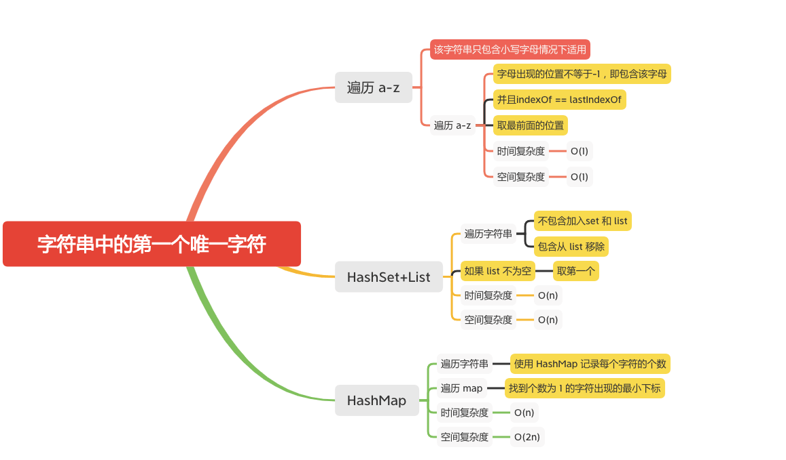

字符串中的第一个唯一字符
====================

#### [387. 字符串中的第一个唯一字符](https://leetcode-cn.com/problems/first-unique-character-in-a-string/)



### 遍历a-z

```java
    public static int firstUniqChar(String s) {
        if (s == null || s.length() == 0) {
            return -1;
        }
        int result = -1;
        for (char c = 'a'; c <= 'z'; ++c) {
           int pre = s.indexOf(c);
           // 字母出现的位置不等于-1，即包含该字母,并且indexOf == lastIndexOf
           if (pre != -1 && pre == s.lastIndexOf(c)) {
               // 取最前面的位置
               result = (result == -1 || pre < result) ? pre : result;
           }
        }
        return result;
    }
```

### HashSet+List
```java
    public int firstUniqChar(String s) {
        if (s == null || s.length() == 0) {
            return -1;
        }
        if (s.length() == 1) {
            return 0;
        }
        int result = -1;
        Set<Character>  set = new HashSet<>();
        List<Character> list = new ArrayList<>();
        for (int i = 0; i < s.length(); i++) {
            Character c = s.charAt(i);
            if (!set.contains(c)) {
                // 不包含加入set 和 list
                set.add(c);
                list.add(c);
            }else {
                // 包含从 list 移除
                list.remove(c);
            }
        }
        if (!list.isEmpty()) {
            // 如果 list 不为空 取第一个
            result = s.indexOf(list.get(0)) ;
        }
        return result;
    }
```

### HashMap
```java
    public static int firstUniqChar(String s) {
        if (s == null || s.length() == 0) {
            return -1;
        }
        if (s.length() == 1) {
            return 0;
        }

        Map<Character, Integer> maps = new HashMap<>();
        char[] chars = s.toCharArray();
        ArrayList<Integer> indexs = new ArrayList<>();
        for (int i = 0; i < s.length(); i++) {
            // 使用 HashMap 记录每个字符的个数
            maps.merge(chars[i],1,Integer::sum);
        }
        int index = Integer.MAX_VALUE;
        for (Map.Entry<Character, Integer> entrySet : maps.entrySet()) {
            if (entrySet.getValue() == 1) {
                // 找到个数为 1 的字符出现的最小下标
                int cIndex = s.indexOf(entrySet.getKey());
                if (cIndex < index) {
                    index = cIndex;
                }
            }
        }
        return index == Integer.MAX_VALUE ? -1 : index;
    }
```

