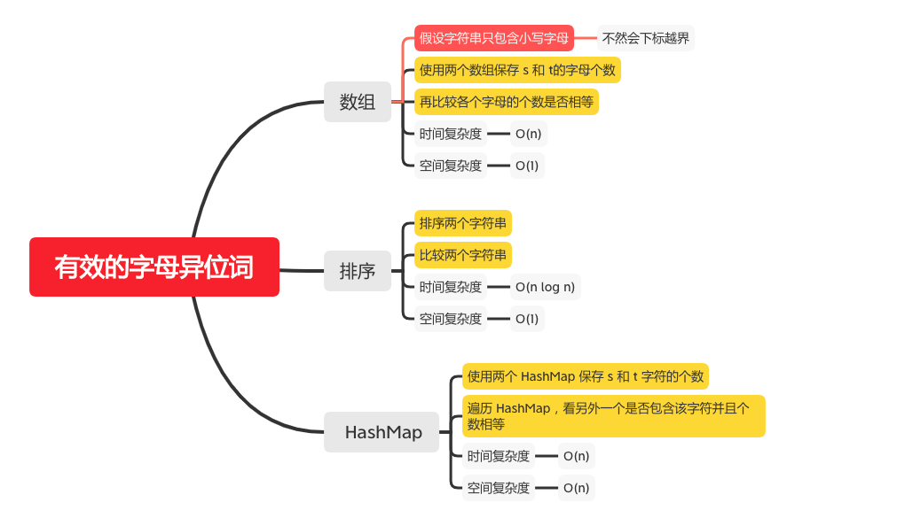

有效的字母异位词
=============

#### [242. 有效的字母异位词](https://leetcode-cn.com/problems/valid-anagram/)



### 数组

```java
    public static boolean isAnagram(String s, String t) {
        if (s == null || t == null) {
            return false;
        }
        if (s.length() != t.length()) {
            return false;
        }
        if (s.length() == 0 && t.length() == 0) {
            return true;
        }
        char[] sChars = s.toCharArray();
        char[] tChars = t.toCharArray();
        int[] sCounts = new int[26];
        int[] tCounts = new int[26];
        for (int i = 0; i < sChars.length; i++) {
            sCounts[sChars[i] - 97]++;
            tCounts[tChars[i] - 97]++;
        }
        // 再比较各个字母的个数是否相等
        for (int i = 0; i < sCounts.length; i++) {
            if (sCounts[i] != tCounts[i]) {
                return false;
            }
        }
        return true;
    
```

### 排序
```java
    public boolean isAnagram(String s, String t) {
        if (s.length() != t.length()) {
            return false;
        }
        char[] str1 = s.toCharArray();
        char[] str2 = t.toCharArray();
        Arrays.sort(str1);
        Arrays.sort(str2);
        return Arrays.equals(str1, str2);
    }
```

### HashMap
```java
    public static boolean isAnagram(String s, String t) {
        if (s == null || t == null) {
            return false;
        }
        if (s.length() != t.length()) {
            return false;
        }
        HashMap<Character, Integer> sMap = new HashMap<>();
        HashMap<Character, Integer> tMap = new HashMap<>();
        for (int i = 0; i < s.length(); i++) {
            sMap.merge(s.charAt(i), 1, Integer::sum);
        }
        for (int i = 0; i < t.length(); i++) {
            tMap.merge(t.charAt(i), 1, Integer::sum);
        }
        // 遍历 HashMap，看另外一个是否包含该字符并且个数相等
        for (Map.Entry<Character, Integer> entry : sMap.entrySet()) {
            if (tMap.get(entry.getKey()) == null || tMap.get(entry.getKey()).intValue() != entry.getValue().intValue()) {
                return false;
            }
        }

        return true;
    }
```