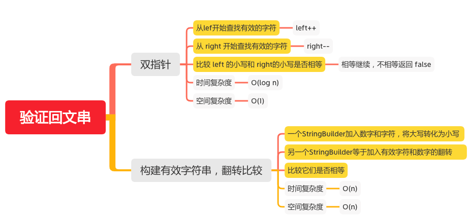

验证回文串
========

#### [125. 验证回文串](https://leetcode-cn.com/problems/valid-palindrome/)



### 双指针
```java
    public boolean isPalindrome(String s) {
        if (s == null) {
            return false;
        }
        if (s.length() == 0) {
            return true;
        }
        int n = s.length();
        int left = 0, right = n - 1;
        while (left < right) {
            // 从lef开始查找有效的字符
            while (left < right && !Character.isLetterOrDigit(s.charAt(left))) {
                left++;
            }
            // 从 right 开始查找有效的字符
            while (left < right && !Character.isLetterOrDigit(s.charAt(right))) {
                right--;
            }
            if (left < right) {
                // 比较 left 的小写和 right的小写是否相等
                if (Character.toLowerCase(s.charAt(left)) != Character.toLowerCase(s.charAt(right))) {
                    return false;
                }
                left++;
                right--;
            }
        }
        return true;
    }
```

### 构建有效字符串，翻转比较
```java
    public boolean isPalindrome(String s) {
        if (s == null) {
            return false;
        }
        if (s.length() == 0) {
            return true;
        }
        StringBuilder sgood = new StringBuilder();
        int length = s.length();
        //一个StringBuilder加入数字和字符，将大写转化为小写
        for (int i = 0; i < length; i++) {
            char ch = s.charAt(i);
            if (Character.isLetterOrDigit(ch)) {
                sgood.append(Character.toLowerCase(ch));
            }
        }
        // 另一个StringBuilder等于加入有效字符和数字的翻转
        StringBuilder sgood_rev = new StringBuilder(sgood).reverse();
        // 比较它们是否相等
        return sgood.toString().equals(sgood_rev.toString());
    }
```