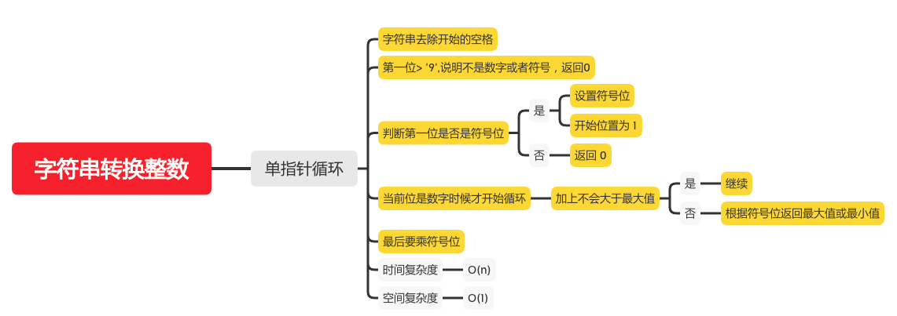

字符串转换整数
===========


#### [8. 字符串转换整数 (atoi)](https://leetcode-cn.com/problems/string-to-integer-atoi/)



### 单指针循环

```java
    public static int myAtoi(String str) {
        if (str == null || str.length() == 0) {
            return 0;
        }
        char[] chars = str.trim().toCharArray();
        if (chars.length == 0) {
            return 0;
        }
        char c0 = chars[0];
        int sign = 1;
        int start = 0;
        // 第一位> '9',说明不是数字或者符号，返回0
        if (c0 > '9') {
            return 0;
        }
        // 判断第一位是否是符号位
        if (c0 < '0') {
            if (c0 == '+' || c0 == '-') {
                sign = c0 == '-' ? -1 : 1;
                start = 1;
            } else {
                return 0;
            }
        }
        int rev = 0;
        int max = Integer.MAX_VALUE / 10;
        while (start < chars.length && (chars[start] >= '0' && chars[start] <= '9')) {
            int pop = chars[start] - '0';
            if (rev > max || (rev == max && pop > 7)) {
                // 根据符号位返回最大值或最小值
                return sign == 1 ? Integer.MAX_VALUE : Integer.MIN_VALUE;
            }
            // 加上不会大于最大值
            rev = rev * 10 + pop;
            start++;
        }
        // 最后要乘符号位
        return rev * sign;

    }
```