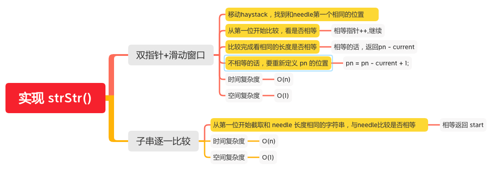

实现 strStr()
=========

#### [28. 实现 strStr()](https://leetcode-cn.com/problems/implement-strstr/)



### 双指针+滑动窗口

```java
    public int strStr(String haystack, String needle) {
        if (haystack == null || needle == null) {
            return -1;
        }
        int L = needle.length(), n = haystack.length();
        if (L == 0) {
            return 0;
        }

        int pn = 0;
        int end = n - L + 1;
        while (pn < end) {
            // 移动haystack，找到和needle第一个相同的位置
            while (pn < end && haystack.charAt(pn) != needle.charAt(0)) {
                pn++;
            }
            int current = 0;
            // 从第一位开始比较，看是否相等
            while (current < L && pn < n && haystack.charAt(pn) == needle.charAt(current)) {
                //  相等指针++,继续
                pn++;
                current++;
            }
            // 比较完成看相同的长度是否相等
            if (current == L) {
                //相等的话，返回 pn - current
                return pn - current;
            }
            // 不相等的话，要重新定义 pn 的位置
            pn = pn - current + 1;
        }
        return -1;
    }
```

### 子串逐一比较
```java
    public static int strStr(String haystack, String needle) {
        if (haystack == null || needle == null) {
            return -1;
        }
        if (needle.length() == 0) {
            return 0;
        }
        int L = needle.length(), n = haystack.length();
        int end = n - L + 1;
        for (int start = 0; start < end; ++start) {
            //从第一位开始截取和 needle 长度相同的字符串，与needle比较是否相等
            if (haystack.substring(start, start + L).equals(needle)) {
                return start;
            }
        }
        return -1;
    }
```