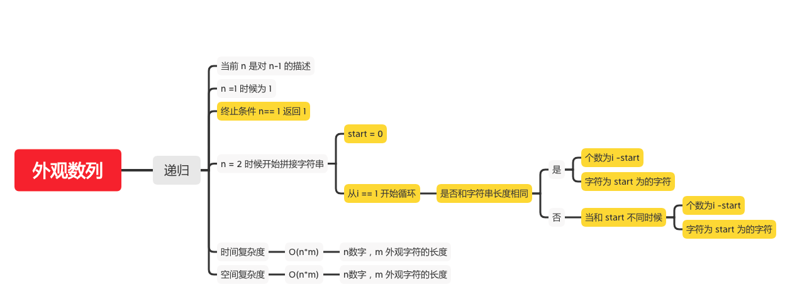

外观数列
======
#### [38. 外观数列](https://leetcode-cn.com/problems/count-and-say/)



### 递归
```java
    public static String countAndSay(int n) {
//        System.out.println("start n = " + n);
        // 递归终止条件
        if (n == 1) {
            return "1";
        }
        // 拿到上一层的字符串
        String str = countAndSay(n - 1);
        StringBuffer res = new StringBuffer();
        int length = str.length();
        // 开始指针为0
        int start = 0;
        // 注意这从起始条件要和下面长度统一
        for (int i = 1; i < length + 1; i++) {
            if (i == length) {
                // 字符串最后一位直接拼接
                res.append(i - start).append(str.charAt(start));
//                System.out.println("i = " + i + ", start = " + start + ", res = " +res.toString());
            } else if (str.charAt(i) != str.charAt(start)) {
                // 直到start位的字符串和i位的字符串不同，拼接并更新start位
                res.append(i - start).append(str.charAt(start));
//                System.out.println("i = " + i + ", start = " + start + ", res = " +res.toString());
                start = i;
            }
        }
//        System.out.println("n = " + n + ", res = " + res.toString());
        return res.toString();
    }
```