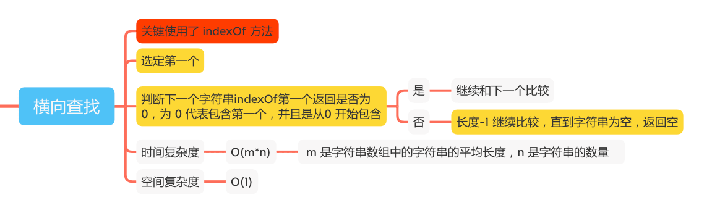
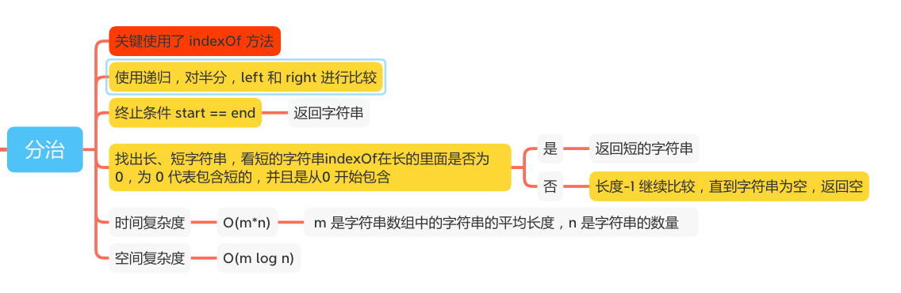
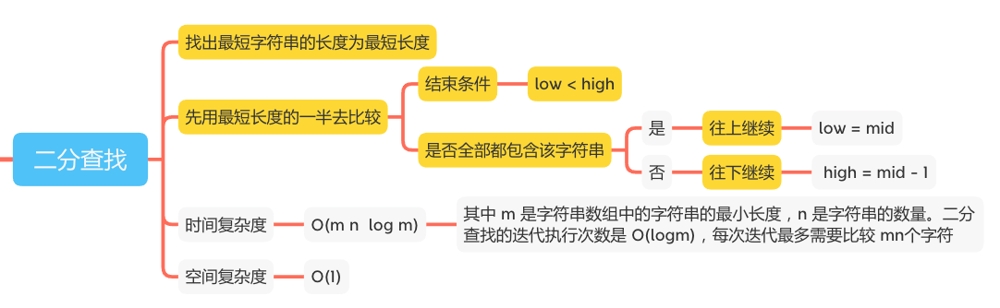

最长公共前缀
==========

#### [14. 最长公共前缀](https://leetcode-cn.com/problems/longest-common-prefix/)







### 横向比较

```java
    public static String longestCommonPrefix(String[] strs) {
        // 为空或者长度为 0
        if (strs == null || strs.length == 0) {
            return "";
        }
        // 有一个为空或者长度为 0
        for (int i = 0; i < strs.length; i++) {
            if (strs[i] == null || strs[i].length() == 0) {
                return "";
            }
        }
        // 选定第一个
        String prefix = strs[0];
        for (int i = 1; i < strs.length; i++) {
            // 判断第一个是否包含在第二个里面,包含继续和下一个比较，进去不了循环
            while (strs[i].indexOf(prefix) != 0) {
                // 长度-1 继续比较，直到字符串为空，返回空
                prefix = prefix.substring(0, prefix.length() - 1);
                if (prefix.isEmpty()) {
                    return "";
                }
            }
        }
        return prefix;
    }
```

### 分治
```java
    public static String longestCommonPrefix(String[] strs) {
        if (strs == null || strs.length == 0) {
            return "";
        }
        for (String str : strs) {
            if (str == null || str.length() == 0) {
                return "";
            }
        }
        return longestCommonPrefix(strs, 0, strs.length - 1);

    }

    // 分治
    public static String longestCommonPrefix(String[] strs, int start, int end) {
        if (start == end) {
            return strs[start];
        } else {
            int mid = (end - start) / 2 + start;
            String left = longestCommonPrefix(strs, start, mid);
            String right = longestCommonPrefix(strs, mid + 1, end);
            return commonPrefix(left, right);
        }
    }

    public static String commonPrefix(String lcpLeft, String lcpRight) {
        String maxLen = null;
        String minLen = null;
        if (lcpLeft.length() >= lcpRight.length()) {
            maxLen = lcpLeft;
            minLen = lcpRight;
        } else {
            maxLen = lcpRight;
            minLen = lcpLeft;
        }
        while (maxLen.indexOf(minLen) != 0) {
            // 长度-1 继续比较，直到字符串为空，返回空
            minLen = minLen.substring(0, minLen.length() - 1);
            if (minLen.isEmpty()) {
                return "";
            }
        }
        return minLen;
    }
```
### 二分查找
```java
    public static String longestCommonPrefix(String[] strs) {
        if (strs == null || strs.length == 0) {
            return "";
        }
        int minLength = Integer.MAX_VALUE;
        for (String str : strs) {
            minLength = Math.min(minLength, str.length());
        }
        int low = 0, high = minLength;
        while (low < high) {
            int mid = (high - low + 1) / 2 + low;
            if (isCommonPrefix(strs, mid)) {
                // 往上继续
                low = mid;
            } else {
                // 往下继续
                high = mid - 1;
            }
        }
        return strs[0].substring(0, low);
    }

    public static boolean isCommonPrefix(String[] strs, int length) {
        String prefix = strs[0].substring(0,length);
        int size = strs.length;
        for (int i = 1; i < size; i++) {
            String str = strs[i];
            for (int j = 0; j < length; j++) {
                if (str.indexOf(prefix) != 0) {
                    return false;
                }
            }
        }
        return true;
    }
```