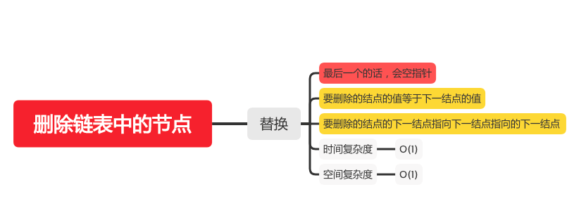

删除链表中的节点
=============

#### [237. 删除链表中的节点](https://leetcode-cn.com/problems/delete-node-in-a-linked-list/)



### 替换
```java
    public void deleteNode(ListNode node) {
        if (node != null && node.next != null) {
            // 要删除的结点的值等于下一结点的值
            node.val = node.next.val;
            // 要删除的结点的下一结点指向下一结点指向的下一结点
            node.next = node.next.next;
        }
    }
```