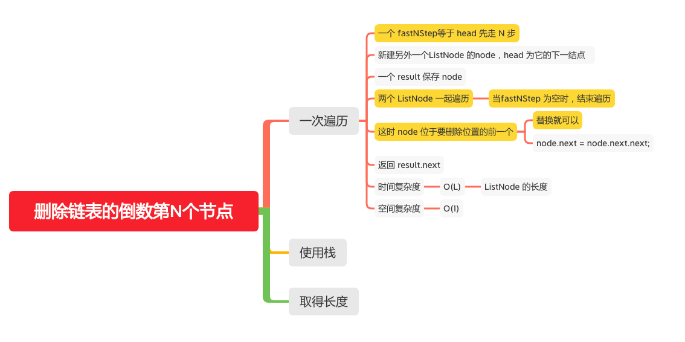

删除链表的倒数第N个节点
===================

#### [19. 删除链表的倒数第N个节点](https://leetcode-cn.com/problems/remove-nth-node-from-end-of-list/)



### 一次遍历

```java
    public static ListNode removeNthFromEnd(ListNode head, int n) {
        if (head == null) {
            return null;
        }
        if(n <= 0) {
            return head;
        }
        // 一个 fastNStep等于 head
        ListNode fastNStep = head;
        // 新建另外一个ListNode 的node，head 为它的下一结点
        ListNode node = new ListNode(0, head);
        // 一个 result 保存 node
        ListNode result = node;
        // 先走 N 步
        for (int i = 0; i < n; i++) {
            if (fastNStep != null) {
                fastNStep = fastNStep.next;
            }

        }
        // 两个 ListNode 一起遍历
        // 当fastNStep 为空时，结束遍历
        while (fastNStep != null) {
            fastNStep = fastNStep.next;
            node = node.next;
        }
        // 这时 node 位于要删除位置的前一个
        node.next = node.next.next;
        return result.next;
    }
```