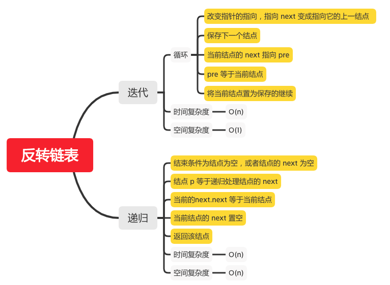

反转链表
=======

#### [206. 反转链表](https://leetcode-cn.com/problems/reverse-linked-list/)



### 迭代
```java
    public static ListNode reverseList(ListNode head) {
        ListNode prev = null;
        ListNode cur = head;
        while (cur != null) {
            // 保存下一个结点
            ListNode tmp = cur.next;
            // 当前结点的 next 指向 pre
            cur.next = prev;
            // pre 等于当前结点
            prev = cur;
            // 将当前结点置为tmp继续
            cur = tmp;
        }
        return prev;
    }

```

### 递归
```java
    public static ListNode reverseList(ListNode head) {
       if (head == null || head.next == null) {
           // 结束条件为结点为空，或者结点的 next 为空
           return head;
       }
       // 结点 p 等于递归处理结点的 next
       ListNode p = reverseList(head.next);
       // 当前的next.next 等于当前结点 即反转
       head.next.next = head;
       // 当前结点的 next 置空
       head.next = null;
       return p;
    }
```
```
	[1,2,3,4,5]
    // 1 h = 1 , p = 2            1 h = 1 , p = 5->4->3->2->1->null
    // 2 h = 2 , p = 3            2 h = 2 , p = 5->4->3->2->null
    // 3 h = 3 , p = 4            3 h = 3 , p = 5->4->3->null
    // 4 h = 4 , p=  5            4 h = 4 , p = 5->4->null
    //                  5 h = 5 
```

