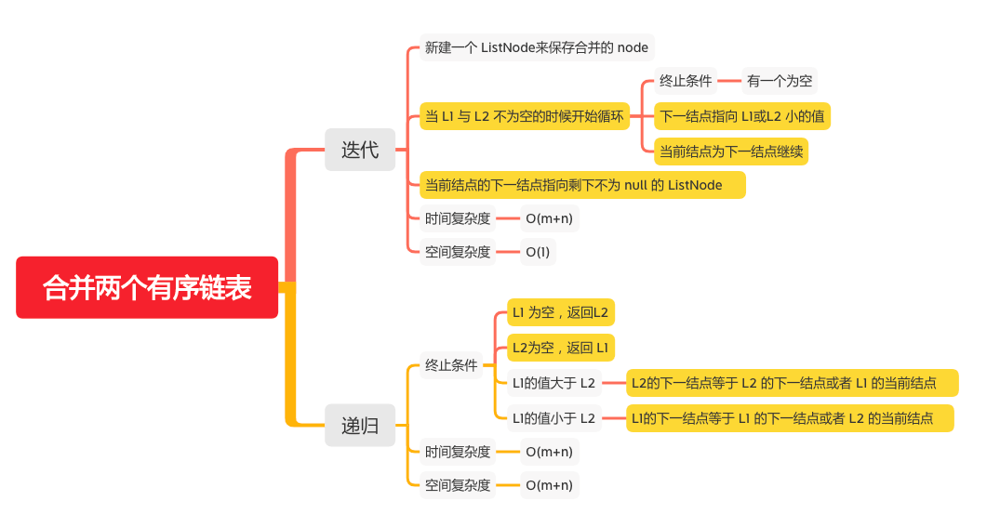

合并两个有序链表
=============

#### [21. 合并两个有序链表](https://leetcode-cn.com/problems/merge-two-sorted-lists/)



### 迭代

```java
    public static ListNode mergeTwoLists(ListNode l1, ListNode l2) {
        if (l1 == null && l2 == null) {
            return null;
        }
        if (l1 == null) {
            return l2;
        }
        if (l2 == null) {
            return l1;
        }
        // 新建一个 ListNode来保存合并的 node
        ListNode result = new ListNode(-1);
        ListNode cur = result;
        // 当 L1 与 L2 不为空的时候开始循环
        while (l1 != null && l2  != null) {
            // 下一结点指向 L1或L2 小的值
            if (l1.val > l2.val) {
                cur.next = l2;
                l2 = l2.next;
            }else {
                cur.next = l1;
                l1 = l1.next;
            }
            // 当前结点为下一结点继续
            cur = cur.next;
        }
        // 当前结点的下一结点指向剩下不为 null 的 ListNode
        cur.next = l1 == null ? l2 : l1;
        return result.next;
    }
```

### 递归
```java
    public static ListNode mergeTwoLists(ListNode l1, ListNode l2) {
       if (l1 == null) {
           // L1 为空，返回L2
           return l2;
       }else if (l2 == null) {
           // L2为空，返回 L1
           return  l1;
       }else if (l1.val > l2.val) {
           // L2的下一结点等于 L2 的下一结点或者 L1 的当前结点
           l2.next = mergeTwoLists(l1,l2.next);
           return l2;
       }else {
           // L1的下一结点等于 L1 的下一结点或者 L2 的当前结点
           l1.next = mergeTwoLists(l1.next,l2);
           return l1;
       }

    }
```