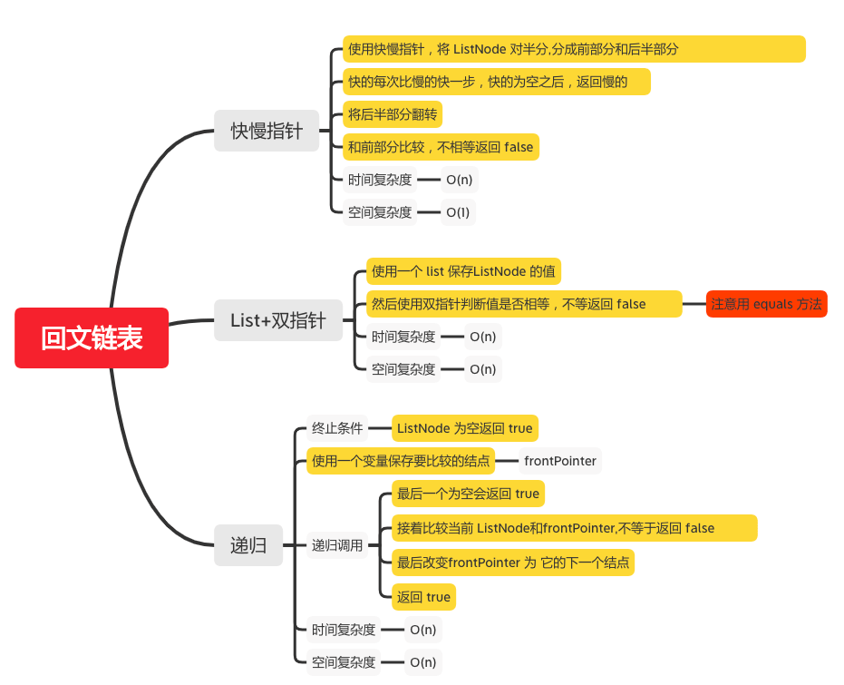

回文链表
=======

#### [234. 回文链表](https://leetcode-cn.com/problems/palindrome-linked-list/)



### 快慢指针

```java
    public static boolean isPalindrome(ListNode head) {
        if (head == null) {
            return true;
        }

        // 使用快慢指针，将 ListNode 对半分
        ListNode firstHalfEnd = endOfFirstHalf(head);
        ListNode secondHalfStart = reverseList(firstHalfEnd.next);

        ListNode p1 = head;
        ListNode p2 = secondHalfStart;
        boolean result = true;
        while (result && p2 != null) {
            if (p1.val != p2.val) {
                result = false;
            }
            p1 = p1.next;
            p2 = p2.next;
        }
        firstHalfEnd.next = reverseList(secondHalfStart);
        return result;
    }

    private static ListNode reverseList(ListNode head) {
        // 使用迭代，翻转 ListNode
        ListNode prev = null;
        ListNode cur = head;
        while (cur != null) {
            ListNode tmp = cur.next;
            cur.next = prev;
            prev = cur;
            cur = tmp;
        }
        return prev;
    }

    private static ListNode endOfFirstHalf(ListNode head) {
       ListNode fast =  head;
       ListNode slow = head;
       // 每次比慢的快一步
       while (fast.next != null && fast.next.next != null) {
           fast = fast.next.next;
           slow = slow.next;
       }
        return slow;
    }

```

### List+双指针
```java
    public static boolean isPalindrome(ListNode head) {
       if (head == null) {
           return true;
       }
       ListNode cur = head;
       ArrayList<Integer> vals = new ArrayList<>();
       while (cur != null) {
           vals.add(cur.val);
           cur = cur.next;
       }
       int left = 0;
       int right = vals.size() -1;
       while (left < right) {
           if (!vals.get(left).equals(vals.get(right)) ) {
               return false;
           }
           left++;
           right--;
       }
       return true;
    }
```

### 递归
```java
    private static ListNode frontPointer;

    public static boolean isPalindrome(ListNode head) {
        frontPointer = head;
        return recursivelyCheck(head);
    }
    private static boolean recursivelyCheck(ListNode currentNode) {
        // ListNode 为空返回 true
        if (currentNode != null) {
            // 最后一个为空会返回 true
            if (!recursivelyCheck(currentNode.next)) {
                return false;
            }
            // 接着比较当前 ListNode和frontPointer,不等于返回 false
            if (currentNode.val != frontPointer.val) {
                return false;
            }
            // 最后改变frontPointer 为 它的下一个结点
            frontPointer = frontPointer.next;
        }
        return true;
    }
```