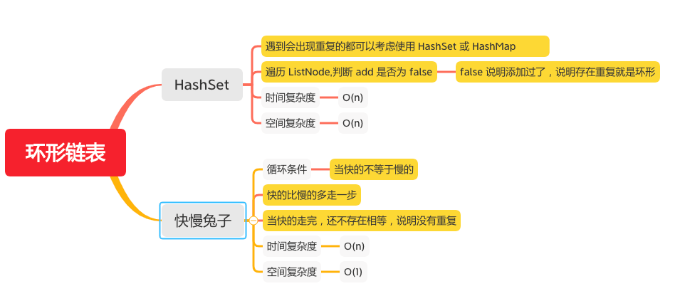

环形链表
======

#### [141. 环形链表](https://leetcode-cn.com/problems/linked-list-cycle/)



### HashSet
```java
    public boolean hasCycle(ListNode head) {
        Set<ListNode> seen = new HashSet<ListNode>();
        while (head != null) {
            // false 说明添加过了，说明存在重复就是环形
            if (!seen.add(head)) {
                return true;
            }
            head = head.next;
        }
        return false;
    }
```

### 快慢兔子
```java
    public boolean hasCycle(ListNode head) {
        if (head == null || head.next == null) {
            return false;
        }
        ListNode fast = head.next;
        ListNode slow = head;
        while (fast != slow) {
            // 当快的走完，还不存在相等，说明没有重复
            if (fast == null || fast.next == null) {
                return false;
            }
            // 快的比慢的多走一步
            fast = fast.next.next;
            slow = slow.next;
        }
        return true;
    }
```
