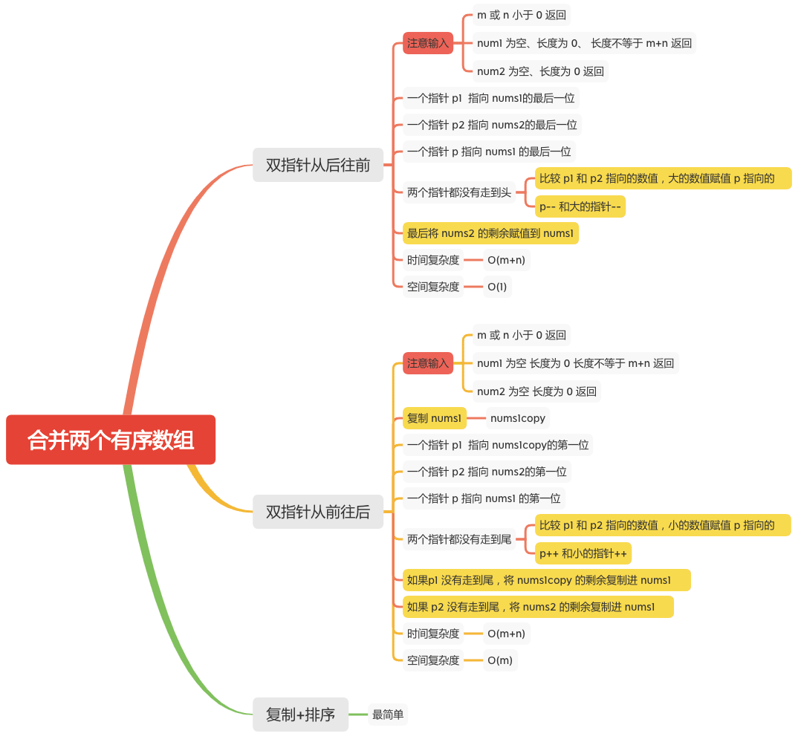

合并两个有序数组
=============

#### [88. 合并两个有序数组](https://leetcode-cn.com/problems/merge-sorted-array/)



### 双指针从后往前
```java
    public void merge(int[] nums1, int m, int[] nums2, int n) {
        if (m < 0 || n < 0) {
            return;
        }
        if (nums1 == null || nums1.length == 0 || nums1.length != m + n) {
            return;
        }
        if (nums2 == null || nums2.length == 0) {
            return;
        }

        int p1 = m - 1;
        int p2 = n - 1;
        int p = m + n - 1;
        while (p1 >= 0 && p2 >= 0) {
            // 比较 p1 和 p2 指向的数值，大的数值赋值 p 指向的
            // p-- 和大的指针--
            nums1[p--] = nums1[p1] > nums2[p2] ? nums1[p1--] : nums2[p2--];
        }
        // 最后将 nums2 的剩余赋值到 nums1
        System.arraycopy(nums2, 0, nums1, 0, p2 + 1);

    }
```

### 双指针从前往后
```java
    public void merge(int[] nums1, int m, int[] nums2, int n) {

        if (m < 0 || n < 0) {
            return;
        }
        if (nums1 == null || nums1.length == 0 || nums1.length != m + n) {
            return;
        }
        if (nums2 == null || nums2.length == 0) {
            return;
        }
        // 复制 nums1
        int[] nums1_copy = new int[m];
        System.arraycopy(nums1, 0, nums1_copy, 0, m);
        int p1 = 0;
        int p2 = 0;
        int p = 0;
        while (p1 < m && p2 < n) {
            // 比较 p1 和 p2 指向的数值，小的数值赋值 p 指向的
            // p++ 和小的指针++
            nums1[p++] = nums1_copy[p1] < nums2[p2] ? nums1_copy[p1++] : nums2[p2++];
        }
        if (p1 < m) {
            // 如果p1 没有走到尾，将 nums1copy 的剩余复制进 nums1
            System.arraycopy(nums1_copy, p1, nums1, p1 + p2, m - p1);
        }
        if (p2 < n) {
            // 如果 p2 没有走到尾，将 nums2 的剩余复制进 nums1
            System.arraycopy(nums2, p2, nums1, p1 + p2, n - p2);
        }
    }
```