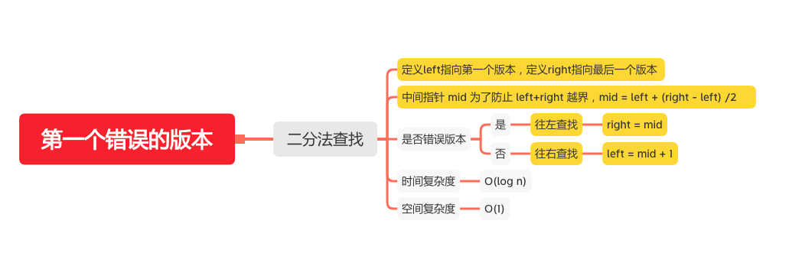

第一个错误的版本
=============

#### [278. 第一个错误的版本](https://leetcode-cn.com/problems/first-bad-version/)





### 二分查找
```java
    public int firstBadVersion(int n) {
       int left = 1;
       int right = n;
       while (left < right) {
           // 中间指针 mid 为了防止 left+right 越界，mid = left + (right - left) /2
           int mid = left + (right - left) / 2;
           if (isBadVersion(mid)) {
               // 往左查找
              right  = mid;
           }else {
               // 往右查找
               left = mid + 1;
           }
       }
       return left;
    }

```