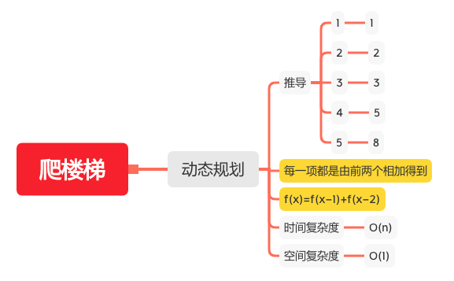

爬楼梯
=====

#### [70. 爬楼梯](https://leetcode-cn.com/problems/climbing-stairs/)



### 动态规划
```java
    public int countPrimes(int n) {
        int r = 1;
        int one = 0;
        int two = 0;
        for (int i = 1; i <= n; i++) {
            // 等于之前的 f(x-1)
            one = two;
            // 等于之前的 f(x)
            two = r;
            // 等于 f（x + 1） =  f(x) + f(x-1)
            r = one + two;
        }
        return r;
    }
```
