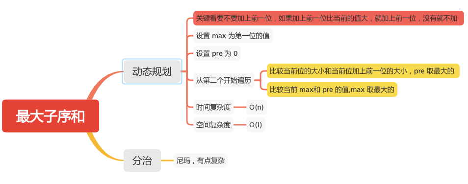

最大子序和
========

#### [53. 最大子序和](https://leetcode-cn.com/problems/maximum-subarray/)



### 动态规划
```java
    public static int maxSubArray(int[] nums) {
        if (nums == null || nums.length == 0) {
            return 0;
        }
        int max = nums[0];
        int pre = 0;
        for (int i = 1; i < nums.length; i++) {
            // 比较当前位的大小和当前位加上前一位的大小，pre 取最大的
            pre = Math.max(nums[i], nums[i] + nums[i-1]);
            // 比较当前 max和 pre 的值,max 取最大的
            max = Math.max(pre, max);
        }

        return max;
    }
```
