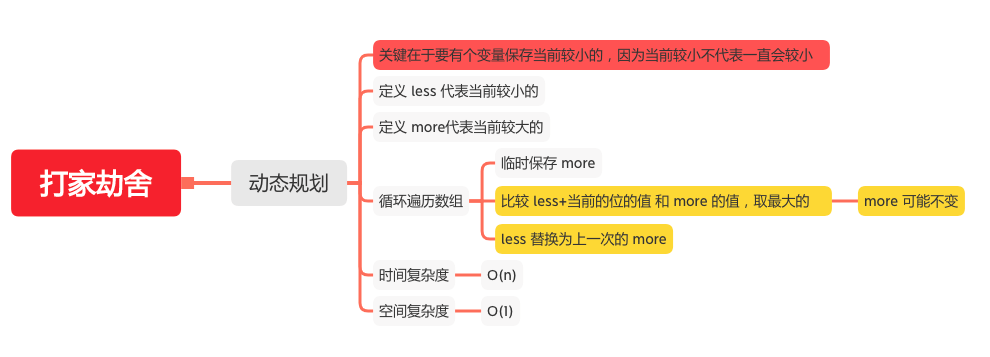

打家劫舍
======

#### [198. 打家劫舍](https://leetcode-cn.com/problems/house-robber/)



### 动态规划
```java
    public static int rob(int[] nums) {
        if (nums == null || nums.length == 0) {
            return 0;
        }
        int length = nums.length;
        if (length == 1) {
            return nums[0];
        }
        int less = nums[0], more = Math.max(nums[0], nums[1]);
        for (int i = 2; i < length; i++) {
           int tmp = more;
           // 比较 less+当前的位的值 和 more 的值，取最大的
           more = Math.max(less + nums[i],more);
           // less 替换为上一次的 more
           less = tmp;
        }
        return more;
    }
```