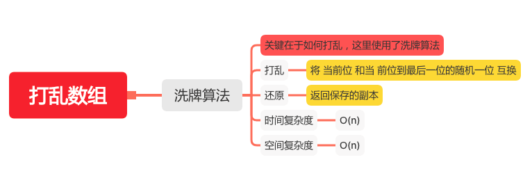

打乱数组
=======

#### [384. 打乱数组](https://leetcode-cn.com/problems/shuffle-an-array/)



### 洗牌算法
```java
    private int[] array;
    private int[] original;

    Random rand = new Random();

    public Solution(int[] nums) {
        array = nums;
        // 保存副本
        original = Arrays.copyOf(nums, nums.length);
    }


    private int randRange(int min, int max) {
        return rand.nextInt(max - min) + min;
    }

    private void swapAt(int i, int j) {
        // 将 当前位 和当 前位到最后一位的随机一位 互换
        int temp = array[i];
        array[i] = array[j];
        array[j] = temp;
    }


    public int[] reset() {
        // 返回保存的副本
        return original;
    }

    public int[] shuffle() {
        for (int i = 0; i < array.length; i++) {
            swapAt(i, randRange(i, array.length));
        }
        return array;
    }
```