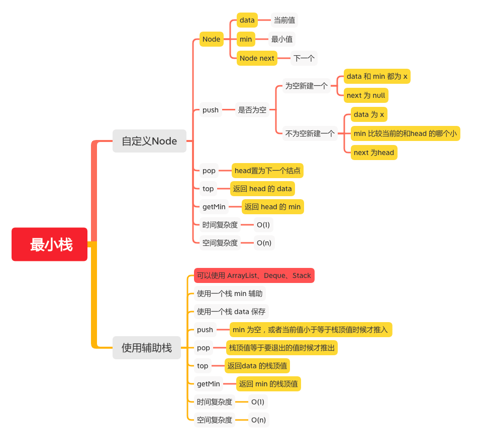

最小栈
=====

#### [155. 最小栈](https://leetcode-cn.com/problems/min-stack/)



### 自定义Node
```java

    public MinStack() {
    }

    public static class Node {
        /**
         * 当前值
         */
        int data;
        /**
         * 最小值
         */
        int min;
        /**
         * 下一个
         */
        Node next;

        public Node(int data, int min, Node next) {
            this.data = data;
            this.min = min;
            this.next = next;
        }
    }

    Node head;

    public void push(int x) {
        if (head == null) {
            // data 和 min 都为 x
            head = new Node(x, x, null);
        } else {
            // data 为 x min 比较当前的和head 的哪个小 next 为head
            head = new Node(x, Math.min(x, head.min), head);
        }

    }

    public void pop() {
        if (head != null) {
            // head置为下一个结点
            head = head.next;
        }
    }

    public int top() {
        // 返回 head 的 data
        return head.data;
    }

    public int getMin() {
        // 返回 head 的 min
        return head.min;
    }
```

### 辅助栈
```java
    private Deque<Integer> data;
    private Deque<Integer> min;


    public MinStack() {
        data = new LinkedList<>();
        min = new LinkedList<>();
    }

    public void push(int x) {
        data.push(x);
        if (min.isEmpty() || x <= min.peek()) {
            min.push(x);
        }
    }

    public void pop() {
        int x = data.pop();
        if (x == min.peek()) {
            min.pop();
        }
    }

    public int top() {
        return data.peek();
    }

    public int getMin() {
        return min.peek();
    }
```