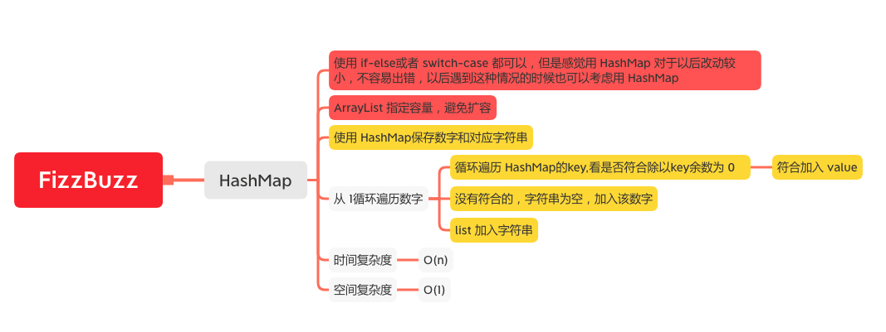

FizzBuzz
=======

#### [412. Fizz Buzz](https://leetcode-cn.com/problems/fizz-buzz/)



### HashMap
```java
    public static List<String> fizzBuzz(int n) {
        // ArrayList 指定容量，避免扩容
        List<String> list = new ArrayList<>(n);
        // 使用 HashMap保存数字和对应字符串
        HashMap<Integer,String> map = new HashMap<Integer,String>() {
            {
                put(3,"Fizz");
                put(5,"Buzz");
            }
        };
        for (int i = 1; i <= n; i++) {
            StringBuilder stringBuilder = new StringBuilder();
            for (Integer key : map.keySet()) {
                // 循环遍历 HashMap的key,看是否符合除以key余数为 0
                if (i % key == 0) {
                    //  符合加入 value
                    stringBuilder.append(map.get(key));
                }
            }
            // 没有符合的，字符串为空，加入该数字
            if (stringBuilder.toString().isEmpty()) {
                stringBuilder.append(i);
            }
            // list 加入字符串
            list.add(stringBuilder.toString());
        }
        return list;
    }
```