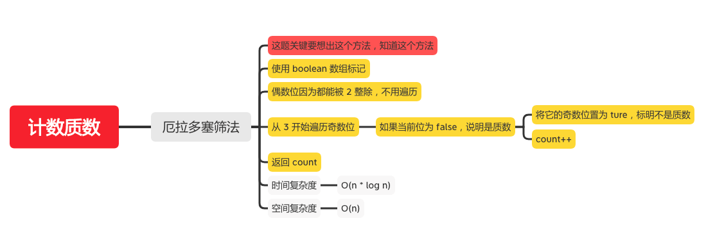

计数质数
=======

#### [204. 计数质数](https://leetcode-cn.com/problems/count-primes/)



### 厄拉多塞筛法
```java
    public int countPrimes(int n) {
        if (n < 0) {
            return 0;
        }
        int count = 0;
        // 使用 boolean 数组标记
        boolean[] nums = new boolean[n];
        if (n > 2) {
            count++;
        }
        // 偶数位因为都能被 2 整除，不用遍历
        // 从 3 开始遍历奇数位
        for (int i = 3; i < n; i += 2) {
            // 如果当前位为 false，说明是质数
            if (!nums[i]) {
                // 将它的奇数位置为 ture，标明不是质数
                for (int j = 3; i * j < n ; j += 2) {
                    nums[i*j] = true;
                }
                count++;
            }
        }
        return count;
    }
```