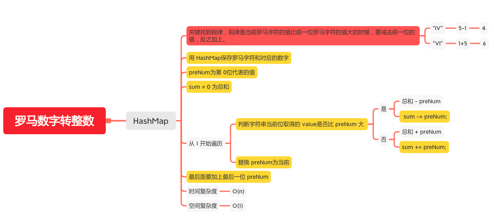

罗马数字转整数
============

#### [13. 罗马数字转整数](https://leetcode-cn.com/problems/roman-to-integer/)



### HashMap
```java
    public static int romanToInt(String s) {
        // sum = 0 为总和
        int sum = 0;
        if (s == null || s.length() == 0) {
            return sum;
        }
        // 用 HashMap保存罗马字符和对应的数字
        HashMap<Character, Integer> roman = new HashMap<Character, Integer>() {
            {
                put('I', 1);
                put('V', 5);
                put('X', 10);
                put('L', 50);
                put('C', 100);
                put('D', 500);
                put('M', 1000);
            }
        };
        // preNum为第 0位代表的值
        int preNum = roman.getOrDefault(s.charAt(0), 0);
        for (int i = 1; i < s.length(); i++) {
            // 判断字符串当前位取得的 value是否比 preNum 大
            int cur = roman.getOrDefault(s.charAt(i), 0);
            if (preNum < cur) {
                sum -= preNum;
            } else {
                sum += preNum;
            }
            // 替换 preNum
            preNum = cur;
        }
        // 最后面要加上最后一位 preNum
        sum += preNum;
        return sum;
    }
```