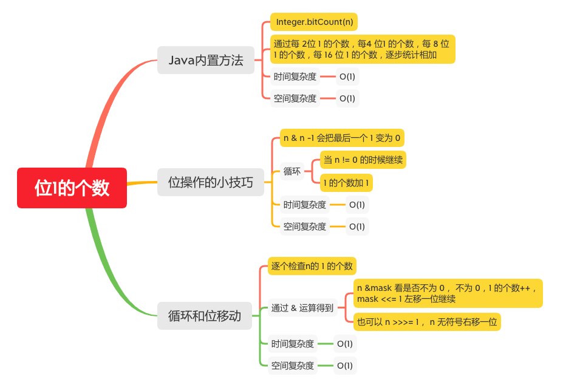

位1的个数
========

#### [191. 位1的个数](https://leetcode-cn.com/problems/number-of-1-bits/)



### Java内置方法
```java
    public static int hammingWeight(int n) {
       return Integer.bitCount(n);
    }

        i = i - ((i >>> 1) & 0x55555555);//01
        // 100
        // 01 10 01 00
        // 00 01 00 00
        // 01 01 01 00

        // 11 11 11 11 11 11 11 11 11 11 11 11 10 01 11 00
        // 01 01 01 01 01 01 01 01 01 01 01 01 01 00 01 00
        // 每 2 位共有几个 1
        // 10 10 10 10 10 10 10 10 10 10 10 10 01 01 10 00

        i = (i & 0x33333333) + ((i >>> 2) & 0x33333333);//0011
        // 0001 0000
        // 0001 0001
        // 0010 0001

        // 低2位有几个 1
        // 1010 1010 1010 1010 1010 1010 0101 1000
        // 0011 0011 0011 0011 0011 0011 0011 0011
        // 0010 0010 0010 0010 0010 0010 0001 0000
        // 高2位有几个 1
        // 0010 1010 1010 1010 1010 1010 1001 0110
        // 0011 0011 0011 0011 0011 0011 0011 0011
        // 0010 0010 0010 0010 0010 0010 0001 0010

        //    每 4 位共有几个1
        //  0010 0010 0010 0010 0010 0010 0001 0000
        //  0010 0010 0010 0010 0010 0010 0001 0010

        //  0100 0100 0100 0100 0100 0100 0010 0010

        //  1111 1111 1111 1111 1111 1111 1001 1100

        i = (i + (i >>> 4)) & 0x0f0f0f0f;//00001111
        // 01
        // 10
        // 11
        // 低 4 位共有几个1
        // 0100 0100 0100 0100 0100 0100 0010 0010
        // 0000 1111 0000 1111 0000 1111 0000 1111
        // 0000 0100 0000 0100 0000 0100 0000 0010

        // 高四位共有几个 1
        // 0000 0100 0100 0100 0100 0100 0100 0010
        // 0000 1111 0000 1111 0000 1111 0000 1111
        // 0000 0100 0000 0100 0000 0100 0000 0010

        // 每 8 位共有几个 1
        //  00000100  00000100 00000100 00000010
        //  00000100  00000100 00000100 00000010
        //  00001000  00001000 00001000 00000100
        //  11111111  11111111 11111111 10011100
        i = i + (i >>> 8);
        // 11
        // 低 8 位
        // 00001000 00001000 00001000 00000100
        // 高 8 位
        // 00000000 00001000 00001000 00001000
        //              8 + 8 =16  4 + 8 = 12
        // 1000  00010000 00010000               00001100
        //                1111111111111111       1111111110011100

        i = i + (i >>> 16);
        // 11
        // 低 16 位  1100
        // 0000100000010000 0001000000001100
        // 高 16 位 10000
        // 0000000000000000 0000100000010000
                            // 16 + 12 = 28
        // 0000100000010000 0001100000011100
        return i & 0x3f;
        // 11

        // 111111
        // 011100
```

> 参考文章 
> [Java源码解释之Integer.bitCount](https://www.cnblogs.com/inmoonlight/p/9301733.html)


### 位操作的小技巧
```java
    public static int hammingWeight(int n) {
        int sum = 0;
        while (n != 0){
            sum++;
            // n & n -1 会把最后一个 1 变为 0
            n &= n -1;
        }
        return sum;
    }
```

### 循环和位移动

```java
    public static int hammingWeight(int n) {
        int bits = 0;
        int mask = 1;
        for (int i = 0; i < 32; i++) {
            // n &mask 看是否不为 0， 不为 0，1 的个数++，mask <<= 1 左移一位继续
            if ((n & mask) != 0) {
                bits++;
            }
          mask <<= 1;
            //也可以 n >>>= 1， n 无符号右移一位
            // n >>>= 1
        }
        return bits;
    }
```