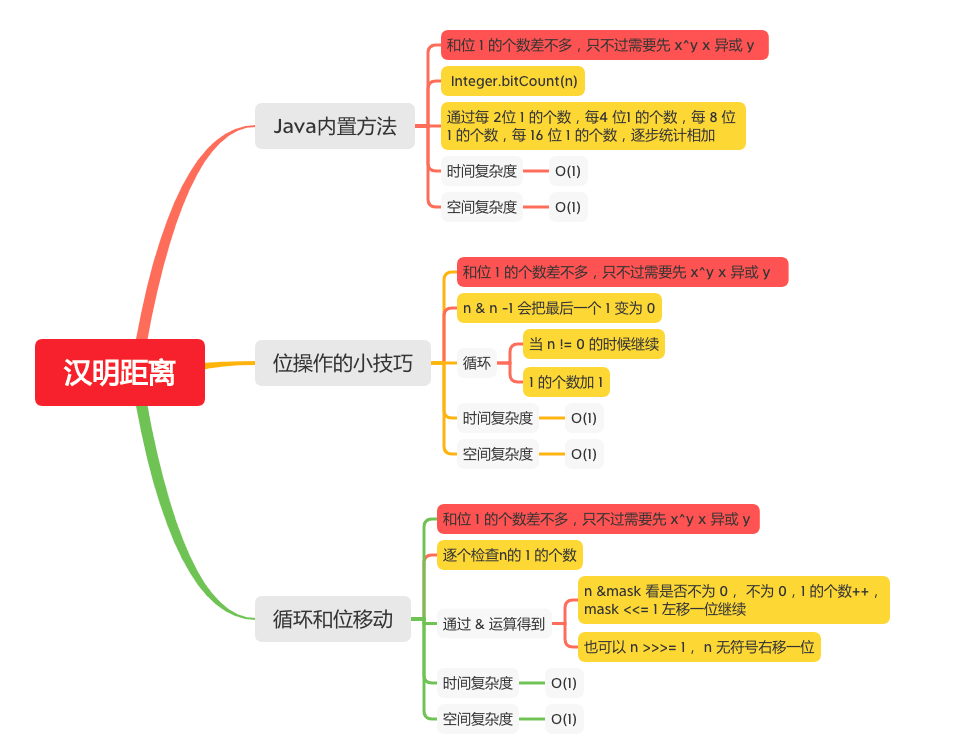

汉明距离
=======

#### [461. 汉明距离](https://leetcode-cn.com/problems/hamming-distance/)



### Java内置方法

```java
    public int hammingDistance(int x, int y) {
        return Integer.bitCount(x ^ y);
    }
```

> 参考文章 
> [Java源码解释之Integer.bitCount](https://www.cnblogs.com/inmoonlight/p/9301733.html)


### 位操作的小技巧
```java
       public static int hammingDistance2(int x, int y) {
        int distance = 0;
        int xor = x ^ y;
        while (xor != 0) {
            distance++;
            // n & n -1 会把最后一个 1 变为 0
            xor &= xor - 1;
        }
        return distance;
    }
```

### 循环和位移动

```java
    public int hammingDistance1(int x, int y) {
        int xor = x ^ y;
        int distance = 0;
        int mask = 1;
        for (int i = 0; i < 32; i++) {
            // n &mask 看是否不为 0， 不为 0，1 的个数++，mask <<= 1 左移一位继续
            if ((xor & mask) != 0) {
                distance++;
            }
            mask <<= 1;
            //也可以 n >>>= 1， n 无符号右移一位
            // n >>>= 1
        }
        return distance;
    }
```