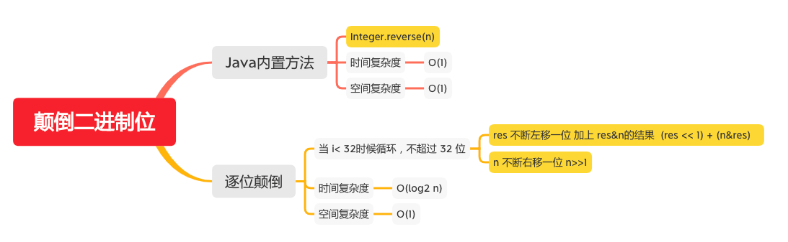

颠倒二进制位
==========

#### [190. 颠倒二进制位](https://leetcode-cn.com/problems/reverse-bits/)



### Java内置方法
```java
    public static int reverseBits(int n) {
       return Integer.reverse(n);
    }
    
        i = (i & 0x55555555) << 1 | (i >>> 1) & 0x55555555;
        // 100
        // 01 10 01 00
        // 01 01 01 01 0x55555555
        // 01 00 01 00 & 0x55555555
        // 10 00 10 00 << 1

        // 01 10 01 00
        // 00 11 00 10 >>> 1
        // 01 01 01 01 0x55555555
        // 00 01 00 00 & 0x55555555

        // 10 00 10 00
        // 00 01 00 00 |
        // 10 01 10 00


        // -100
        // 11111111111111111111111110011100
        // 01010101010101010101010101010101 0x55555555
        // 01010101010101010101010100010100 &0x55555555
        // 10101010101010101010101000101000 << 1

        // 11111111111111111111111110011100
        // 01111111111111111111111111001110 >> 1
        // 01010101010101010101010101000100 0x55555555
        // 01010101010101010101010101000100

        // 10101010101010101010101000101000
        // 01010101010101010101010101000100 |
        // 11111111 11111111 11111111 01101100
        // 11111111 11111111 11111111 10011100

        i = (i & 0x33333333) << 2 | (i >>> 2) & 0x33333333;
        // 1001 1000
        // 0011 0011 0x33333333
        // 0001 0000 &0x33333333
        // 0100 0000 << 2

        // 1001 1000
        // 0010 0110 >>> 2
        // 0011 0011 0x33333333
        // 0010 0010 &0x33333333

        // 0100 0000
        // 0010 0010 |
        // 0110 0010
        // 0110 0100 100

        // 11111111111111111111111101101100
        // 00110011001100110011001100110011 0x33333333
        // 00110011001100110011001100100000 &0x33333333
        // 11001100110011001100110010000000 << 2

        // 11111111111111111111111101101100
        // 00111111111111111111111111011011 >> 2
        // 00110011001100110011001100110011 0x33333333
        // 00110011001100110011001100010011 &0x33333333

        // 11001100110011001100110010000000
        // 00110011001100110011001100010011 |
        // 11111111 11111111 11111111 10010011
        // 11111111 11111111 11111111 10011100

        i = (i & 0x0f0f0f0f) << 4 | (i >>> 4) & 0x0f0f0f0f;
        // 0110 0010
        // 0000 1111 0x0f0f0f0f
        // 0000 0010 &0x0f0f0f0f
        // 0010 0000 << 4

        // 0110 0010
        // 0000 0110 >>> 4
        // 0000 1111 0x0f0f0f0f
        // 0000 0110 &0x0f0f0f0f


        // 0010 0000
        // 0000 0110 |
        // 0010 0110
        // 0110 0100 100

        // 11111111111111111111111110010011
        // 00001111000011110000111100001111 0x0f0f0f0f
        // 00001111000011110000111100000011 &0x0f0f0f0f
        // 11110000111100001111000000110000 << 4


        // 11111111111111111111111110010011
        // 00001111111111111111111111111001 >>> 4
        // 00001111000011110000111100001111 0x0f0f0f0f
        // 00001111000011110000111100001001 &0x0f0f0f0f

        // 处理到这步 头 8 位和尾8 位已经处理好了
        // 11110000 11110000 11110000 00110000
        // 00001111 00001111 00001111 00001001 |
        // 11111111 11111111 11111111 00111001
        // 11111111 11111111 11111111 10011100 -100

        i = (i << 24) | ((i & 0xff00) << 8) | ((i >>> 8) & 0xff00) | (i >>> 24);
        // 00100110
        // 00100110 00000000 00000000 00000000 << 24
        // 00000000 00000000 00000000 00000000
        // 00000000 00000000 00000000 00000000
        // 00000000 00000000 00000000 00000000

        // 11111111 11111111 11111111 00111001
        // 00111001 00000000 00000000 00000000 << 24


        // 11111111 11111111 11111111 00111001
        // 11111111 00000000 11111111 00000000 0xff00
        // 11111111 00000000 11111111 00000000 &0xff00
        // 00000000 11111111 00000000 00000000 << 8


        // 11111111 11111111 11111111 00111001
        // 00000000 11111111 11111111 11111111  >>> 8
        // 11111111 00000000 11111111 00000000 0xff00
        // 00000000 00000000 11111111 00000000 & 0xff00

        // 11111111 11111111 11111111 00111001 >>> 24
        // 00000000 00000000 00000000 11111111

        // 00111001 00000000 00000000 00000000
        // 00000000 11111111 00000000 00000000
        // 00000000 00000000 11111111 00000000
        // 00000000 00000000 00000000 11111111

        // 00111001 11111111 11111111 11111111
        // 11111111 11111111 11111111 01101100
```

### 逐位颠倒
```java
    public  static int reverseBits(int n) {
        int res = 0;
        for (int i = 0; i < 32; i++) {
            res = (res << 1) + (n & 1);
            n >>>= 1;
        }
        return res;
    }
```