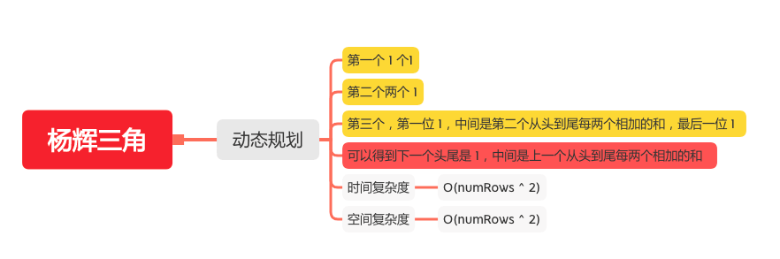

杨辉三角
======

#### [118. 杨辉三角](https://leetcode-cn.com/problems/pascals-triangle/)



### 动态规划
```java
    public static List<List<Integer>> generate(int numRows) {
        List<List<Integer>> triangle = new ArrayList<>();
        if (numRows <= 0) {
            return triangle;
        }
        // 先加上第一行
        List<Integer> one = new ArrayList<>();
        one.add(1);
        triangle.add(one);
        // 从第二行开始
        for (int i = 1; i < numRows; i++) {
            List<Integer> row = new ArrayList<>();
            List<Integer> pre = triangle.get(i - 1);
            // 头加 1
            row.add(1);
            // 中间是前一个从头到尾每两个相加的和
            for (int j = 1; j < pre.size(); j++) {
                row.add(pre.get(j) + pre.get(j - 1));
            }
            // 尾加 1
            row.add(1);
            triangle.add(row);
        }
        return triangle;
    }
```